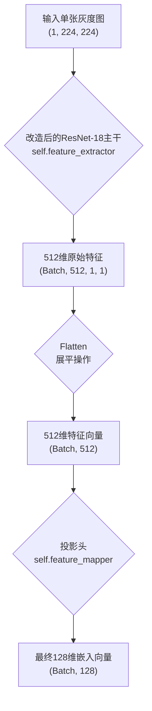
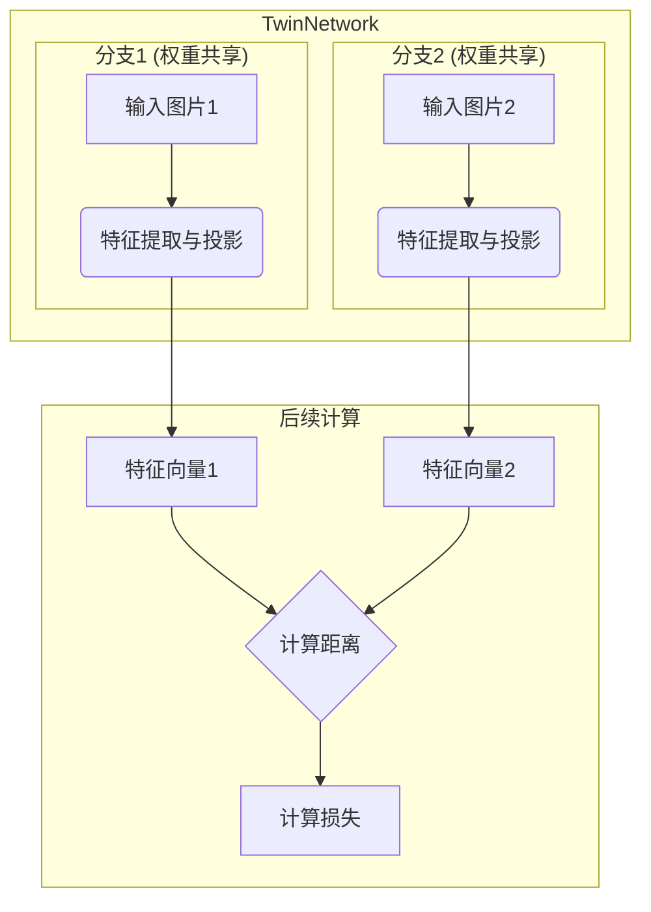
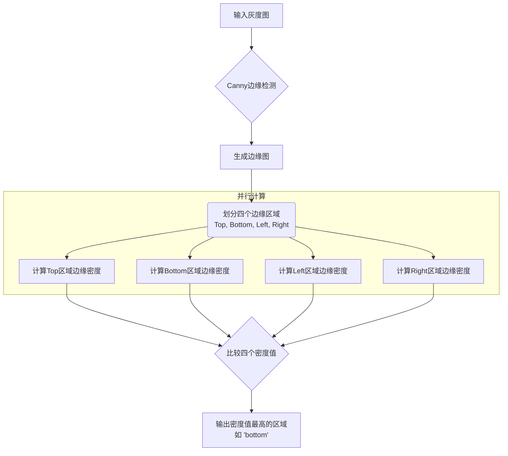
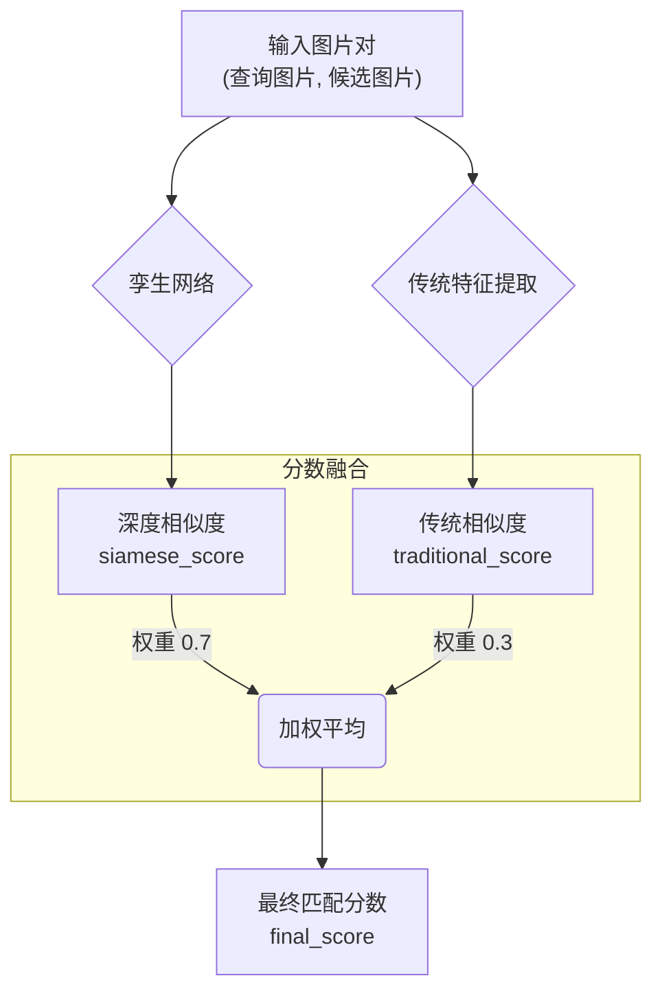
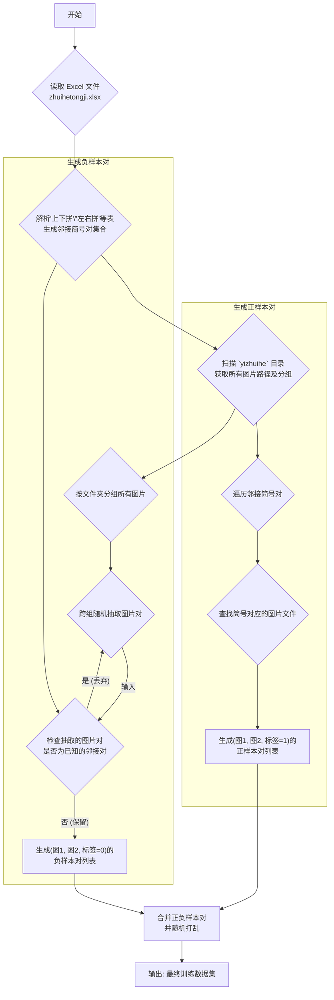
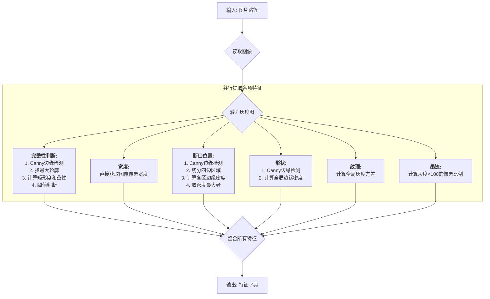
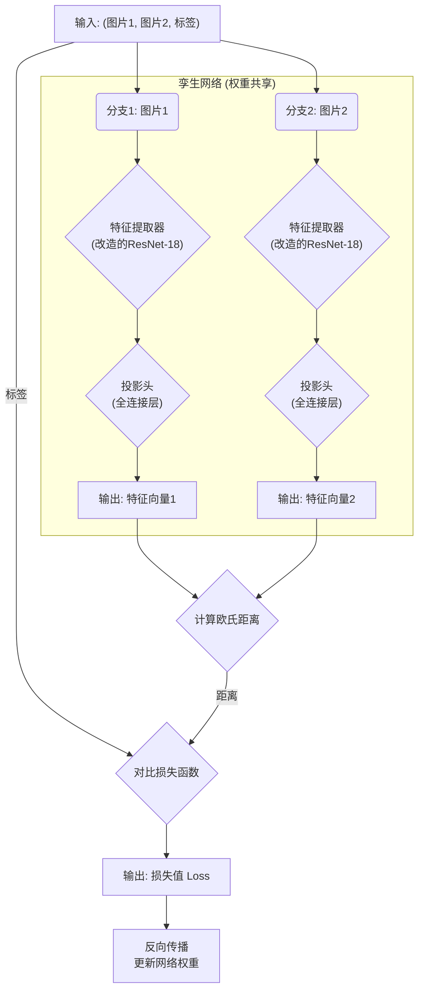
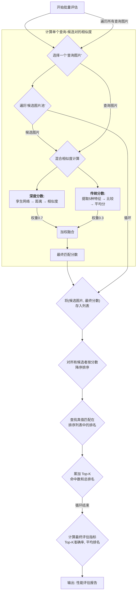

---

# 中山大学计算机学院

# 人工智能

# 本科生实验报告

## （2025学年春季学期）

**课程名称：Artificial Intelligence**

| 教学班级  | 学号     | 专业       | 姓名   |
| --------- | -------- | ---------- | ------ |
| 202420574 | 23336233 | 计算机科学 | 王一澄 |

## 一、实验题目

### **基于深度学习与图像处理的秦简残片自动缀合技术研究与实现**

#### **1. 实验背景与意义**

出土竹简作为研究中国古代历史、思想、制度及文化的重要载体，其信息的完整性至关重要。然而，由于埋藏环境、年代久远等多种因素，竹简在出土时常常呈现为大量散乱、断裂的残片。将这些残片依据其物理特征（如断口形状、竹简纹路）和内容特征（如文字墨迹）重新拼接成完整简牍的“缀合”工作，是释读和研究竹简内容的前提和关键。

传统上，竹简缀合极度依赖考古学和古文字学专家的肉眼观察和手工操作，这项工作不仅需要深厚的专业知识，而且耗时费力、效率低下。随着人工智能，特别是计算机视觉和深度学习技术的飞速发展，利用AI技术实现竹简残片的自动、高效、精准缀合，已成为数字人文与智慧考古领域的前沿研究热点。本实验旨在探索并实践这一技术，以期减轻人工缀合的负担，加速历史文献的整理与研究进程。

#### **2. 实验目标**

本实验的核心目标是：设计并实现一个基于人工智能的自动缀合模型。该模型能够处理《里耶秦简(二)》数据集中的竹简残片图像，通过分析图像特征，自动地从海量残片中找出能够相互拼合的配对组合。

具体来说，实验将围绕以下几个核心任务展开：

1. **残简识别与筛选：** 能够自动区分图像中的竹简是“完整简”还是“残断简”，并将需要进行缀合的残断简筛选出来。
2. **关键特征提取：** 针对筛选出的残断简，模型需要能够准确地提取用于匹配的多种关键特征，包括但不限于：
   - **断口特征：** 精确提取残片断口的几何形状轮廓。
   - **纹理特征：** 提取竹简自身的天然纹路信息。
   - **内容特征：** 识别并提取断口附近的残存文字墨迹。
   - **物理尺寸特征：** 测量并记录简的宽度等基本尺寸信息。
3. **相似度匹配与缀合判断：** 构建一个孪生神经网络，该模型能够接收两枚残简的相片作为输入，通过计算相片间的相似度，并结合传统特征提取的结果。最终判断这两枚残简是否满足缀合条件，并输出匹配成功的组合。

#### **3. 实验数据集**

本实验使用的数据集来源于《里耶秦简(二)》，主要包括：

- **yizhuihe.zip（已缀合集）：** 作为核心的**训练与验证集**。其中包含了由学界专家确认的、可以成功拼缀的残简分组，为监督学习提供了宝贵的“标准答案”（标准答案在zhuihetongji的excel表格之中，需要进行提取）。
- **weizhuihe.zip（未缀合集）：** 作为**测试集或应用集**。其中包含大量尚未找到匹配对象的残简，可用于检验模型的实际应用效果。
- **zhuihetongji.xlsx（缀合统计表）：** 提供了已缀合组的详细信息，是构建训练样本对和评估模型性能的重要依据。

#### **4. 预期成果**

实验的最终成果为一个完整的竹简自动缀合解决方案，包括：

1. 一套能够对竹简图像进行预处理、特征提取和匹配判断的算法流程和代码实现。
2. 一个在yizhuihe数据集上训练完成并经过性能评估的深度学习模型。
3. 一份详细的实验报告，系统阐述从算法原理、模型设计、实现过程到结果分析和优化创新的全部内容。

## 二、实验内容

### 1.算法原理

#### **数据读取与样本对构建**

在训练孪生模型之前，我们是首先要把图片分成一对一对的，让模型可以学习那些图片可以缀合，哪些图片不能缀合。经过查验资料，我发现孪生神经网络的训练需要两种样本对：正样本对和负样本对。其中正样本对是可以缀合的样例，是机器学习的正面例子。而负样本对是随机选择的不能缀合的图片，是机器学习的反面案例。每个样本对包括两张照片和一个标签，能缀合是1，不能缀合是0。

在本次实验中，**训练孪生神经网络用的正样本对是有限的**，即excel文档中相邻的能拼在一起的图片，**而负样本对几乎是无限的**，任意照片排列组合几乎能取到正样本对数量的成百上千倍。**但经过实验检测，负样本对不能取太多**，经过我的一次实验如果把负样本对数量取到正样本对的50倍，那么最后孪生神经网络就算无脑把所有照片对都判定为不能缀合也有98%准确率，这样网络就会偷懒，不能训练出来想要的神经网络。

不仅如此，判断正样本对也有讲究，一开始我以为只要在一个文件夹下面的都是可以缀合的。后来才发现一个文件夹下面的可能是一张竹简的正反面，也有可能是一张竹简的彩照与红外照，也有可能是三四张按顺序拼接的照片。实际上**只有严格按照excel上面描述的方式进行拼接才能找到正确的正样本对**。

下面我来描述我找到正负样本对的流程：

##### **（1）正样本的生成策略**

模型训练的监督信号来源于考古专家已经确认的缀合成果，这些成果被记录在 zhuihetongji.xlsx 文件中。因此，算法的第一步是通过 ZhuiheOrderReader 模块精确地解析该文件。

- **数据源读取**：程序首先加载Excel文件，并重点关注“上下拼”、“左右拼”和“上下+左右拼”等包含直接物理连接关系的工作表。
- **邻接关系提取**：通过遍历这些工作表的行和列，算法提取出所有在空间上直接相邻的竹简编号，形成一个“邻接对”集合，例如 ('9-1897', '9-1848')。这些由专家确认的邻接对构成了我们构建**正样本**的权威依据。为了确保鲁棒性，程序同时记录了正反两个方向的配对，即 (A, B) 和 (B, A) 均被视为有效邻接。
- **编号到文件的映射**：由于模型处理的是图像，算法需要将抽象的竹简编号（如 "9-1897"）映射到实际的图像文件路径（如 yizhuihe/5/01897.jpg）。这一步通过在 yizhuihe 和 weizhuihe 目录中搜索与编号匹配的文件名来实现，并考虑了文件名中可能存在的前导零、后缀等多种格式变化，确保了映射的准确性。

##### **（2） 负样本的生成策略**

仅仅告诉模型“什么是对的”是不够的，还必须提供大量“什么是错的”例子，模型才能学会区分。这些错误的例子即**负样本**。负样本的构建遵循一个简单而有效的原则：**凡是不同缀合组的残简，必然不能拼接。**

- **跨组随机采样**：build_negative_pairs 函数首先将所有图片按其所在的文件夹（缀合组）进行分组。然后，它随机地从两个**不同**的组中各抽取一张图片，将它们配对。
- **避免“假阴性”问题**：我实现的一个关键的优化是：在生成负样本时，需要确保随机组成的这对图片不是一个“隐藏”的正样本（例如，专家已确认可拼接，但被我们错误地标记为负样本）。为了避免这种情况，算法会查询 ZhuiheOrderReader 提供的权威邻接对集合，如果随机生成的样本对恰好存在于该集合中，则将其丢弃，重新生成，从而保证了负样本的纯度。

##### **（3）数据集的最终构建**

通过上述步骤，我们获得了大量的正样本对（标签为1）和负样本对（标签为0）。

- **正样本**：由 build_positive_pairs 函数生成，每一个样本对 (图像A路径, 图像B路径, 1) 都代表了一个已知的、正确的拼接关系。
- **负样本**：由 build_negative_pairs 函数生成，每一个样本对 (图像C路径, 图像D路径, 0) 都代表了一个已知的、错误的拼接关系。

最终，这两部分数据被合并，形成一个完整的数据集。这个数据集中的每一个元素都包含了模型学习所需的一切：一对输入的图像和它们之间关系的明确标签。这个结构化的数据集是后续训练孪生神经网络进行相似度学习的直接输入。


> 下图是数据提取与样本对构建，详细输出脚本的输出。从图中可以看到数据提取和样本对构建的全流程（此处我定义的生成五倍负样本）


#### **孪生神经网络学习**

在构建了正确的正负样本对之后，我们需要训练一个神经网络来区分任意两张图片是可缀合还是不可缀合。那么我们就需要搞一个能判别图像对的深度学习模型。我一开始也想了用重要判定实验用过的cnn网络。但后来仔细学习了试验任务文档中介绍的孪生神经网络之后，我发现其实传统的神经网络比如cnn，其实不适合做这个竹简配对的项目。

> 为什么传统cnn不能处理本次实验？

因为标准CNN的输入是**单张图片**，其目标是输出一个表示该图片所属类别的概率分布。而我们的任务输入是**一对图片**，目标是判断这对图片之间的**关系**（是否能缀合）。如果试图将两张残片图拼接成一张大图送入CNN，不仅会因拼接方式的多样性（横向、纵向、对齐方式）引入巨大噪音，还会破坏每张图片独立的边缘和纹理特征，使网络难以学习到有效的断口匹配信息。

不仅如此，传统CNN的**分类性**也是一个大问题。CNN要求训练时所有的类别都是已知的。在缀合任务中，这意味着我们需要为**每一个可能成功的缀合对**都定义一个独立的类别，这在计算上是不可行的，因为潜在的组合数量是天文数字。而且当面对一个在训练集中从未出现过的新残片时，模型将彻底失效，因为它没有见过这个新类别，完全不具备对未知样本进行相似度比较的泛化能力。这种架构上的缺陷决定了传统CNN无法学习到一种通用的、可迁移的“匹配规则”，而只能死记硬背训练过的特定组合。

> 孪生神经网络处理的优势

与传统CNN不同。孪生神经网络将学习目标从“识别特定类别”转换为了**“学习一个通用的相似度度量函数”**。网络的核心是一个CNN特征提取器（在我的模型中是ResNet18)，这个提取器被**复制**成两个结构完全相同、且**权重共享**的“孪生”分支。


当一对竹简图片分别通过这两个相同的分支时，权重共享机制保证了它们被**以完全一致的方式**映射到同一个低维特征空间中，产出两个特征向量。它有两个优势：首先，它自然地处理了**成对输入**的问题，将复杂的图像对关系判断，简化为特征空间中两个向量点的**距离计算**问题。其次，由于网络学习的不是某个具体的残片“长什么样”，而是如何提取出最能体现其断口、纹理等关键信息的**通用特征**，因此它具备了强大的**泛化能力**。即使面对从未在训练集中见过的全新残片，训练好的网络依然能为其生成一个有意义的特征向量。

孪生神经网络通过对比损失函数等度量学习策略的引导，能将可缀合的图片对（正样本）映射为特征空间中距离相近的点，而将不可缀合的图片对（负样本）映射为距离遥远的点，从而完美地解决了开放世界中的匹配难题。


分析了孪生神经网络的优点之后，我们的思路就显而易见了：利用刚刚生成的正负样本对训练一个孪生神经网络！

整个特征学习与模型训练过程主要包括数据集划分、网络结构设计、损失函数定义与模型训练四个环节。


##### （1）数据集划分

根据以前做神经网络的经验，在训练之前我们需要将数据集分成测试集和训练集。模型在训练的时候只能在训练集上训练，绝对不能偷看测试集（可以跑测试集来看测试集准确率，但绝对不能用于训练）。然后后续评估的时候在测试集上测试模型泛化性，避免过拟合。

下面我来详细的介绍一下训练集和测试集的作用：

- **训练集**：用于模型的讯息。模型会反复迭代地观察训练集中的样本（包括正样本和负样本），并根据损失函数计算出的误差来调整其内部的权重参数。让模型充分学习到数据中存在的模式和规律。

- **验证集**：这是一部分模型在训练过程中“从未见过”的数据。在每个训练周期结束时，我们会使用当前训练好的模型在验证集上进行一次“模拟考试”。由于模型没有利用验证集的数据来更新权重，因此其在验证集上的表现能够**客观地反映模型对新数据的泛化能力**。验证集的主要作用有：

  1. **模型选择与超参数调优**：通过比较不同模型结构或不同超参数（如学习率、批次大小）在验证集上的性能，我们可以选择出最优的配置。

  2. **防止过拟合**：如果在训练过程中，模型在训练集上的准确率持续上升，但在验证集上的准确率却开始停滞甚至下降，这便是一个典型的过拟合信号。它意味着模型“死记硬背”了训练数据的特征，而丧失了对未知数据的判别能力。通过监控验证集的性能，我在本次代码中采用了策略（如早停、增加正则化等）来避免过拟合。

     

> 其实早在分正负对之前，我就对文件夹进行了训练集和测试集的分割。之后正负样本对都是直接从训练集/测试集上单独生成的，完全不可能有泄露答案的可能性。下图是我对文件夹的分割。之后对yizhuihe的图片评估也是用的测试集。


在本实验中，我按照80%作为训练集，20%作为验证集的比例进行了随机抽样划分。**随机性**是划分过程中的一个关键要素，它确保了训练集和验证集在数据分布上保持一致，从而使得验证集上的评估结果能够可靠地代表模型在整个数据集上的泛化水平。通过这种方式，我们为后续的模型训练、评估和优化建立了一个科学、公正的实验框架。

##### （2）网络结构设计与实现

在分完训练集之后，我们就要进行网络的搭建了。为了将输入的竹简图像对转化为可供比较的特征向量，我设计并实现了一个名为 `TwinNetwork` 的孪生神经网络。

我的孪生神经网络架构并非从零开始搭建，而是以一个在大型图像数据集上预训练过的、强大的卷积神经网络作为特征提取的主干，再辅以专为本任务设计的网络层，从而在保证模型性能的同时，极大地提升了训练效率和模型的泛化能力。

本网络的具体结构设计分为以下几个关键部分：

###### **A. 核心特征提取器：改造的ResNet-18**

网络的主干部分负责从原始的竹简图像中提取深层次的、有判别力的视觉特征。我没有自行设计一个全新的CNN，而是选择了在计算机视觉领域被广泛验证、性能卓越的 **ResNet-18** 模型。

> 选择用预训练模型的原因

如果直接在一个相对较小且专业的数据集（比如我们这次实验的竹简图像）上从零开始训练一个深度网络，容易导致过拟合且收敛困难。所以我选用了预训练模型resnet18：`models.resnet18(weights=None)` 。虽然在此处未加载预训练权重，但其**成熟的架构本身**就是一种知识的迁移。

ResNet的残差连接结构还能够有效缓解梯度消失问题，使得网络可以学习到更深层次的特征，这对于捕捉竹简断口细微的形状和纹理变化至关重要。

> ResNet18不采用预训练权重的原因

我一开始采用了resnet18的预训练权重来训练，但训练效果非常不理想。


可以看到采用预训练权重时，系统基本准确率基本在60%-70%之间，后面学习也没有明显提升，甚至因为性能回退触发了早停机制。后面我不用预训练权重来训练，效果提升相当显著。

经过网上查阅相关资料，我总结了以下几点可能的原因：

1. **特征维度不匹配**

   - **ImageNet预训练的目标**：ImageNet数据集包含1000个类别的日常物品，如猫、狗、汽车、飞机等。在其上训练的模型，其深层网络学会的是**识别宏观的、具有语义信息的物体特征**。例如，网络的高层神经元可能被激活用来识别“猫耳的轮廓”、“车轮的圆形”或“鸟的羽毛纹理”。这些特征是**类别性的、语义驱动的**。
   - **本次竹简缀合任务的目标**：我们的任务则完全不同。我们不关心图片“是什么”（它永远是竹简），而是关心**两张图片在物理上是否能精确拼接**。决定性信息在于**微观的、不含语义的几何与纹理特征**：断口的**精确形状轮廓**、竹简上**细微的天然纹路**是否连续，以及断口处**残墨的笔画**是否能衔接。这些是**几何驱动的、像素级的**精细特征。

   所以一个被训练用来识别“猫”和“狗”的神经网络，其内部的权重已经固化，倾向于去寻找宏观的、有意义的形状。而当它面对两片竹简时，它会徒劳地尝试在其中寻找“猫耳”或“车轮”，而这些对我们的任务来说是纯粹的**噪声**。预训练权重带来的这种“语义偏见”会严重干扰网络去学习真正重要的微观断口特征，导致南辕北辙。

2. **输入数据域的差异**

   **ImageNet是彩色的RGB三通道图像数据集，而我们的竹简数据是单通道的灰度图**。预训练模型中，R、G、B三个通道的卷积核是分别独立学习的，它们协同工作以识别彩色世界。简单地将它们平均，所得到的新卷积核并不一定是对灰度世界中的边缘、纹理最优的提取器。相比之下，从随机初始化开始训练，允许网络的第一层卷积核**完全为适应竹简的灰度特性而生**，从零开始学习如何最有效地捕捉灰度图中的关键信息。

3. **低层特征与高层特征的权衡**

   迁移学习的一个经典假设是，神经网络的底层学习的是通用特征（如边缘、角点、颜色块），而高层学习的是与特定任务相关的抽象特征。对于我们的任务，ResNet-18的**底层特征可能是有用的**（例如，检测断口的边缘），但其**高层特征几乎是完全无用甚至有害的**。

   当整个网络都加载了预训练权重后，高层网络带来的负面影响可能超过了底层带来的正面增益。模型的优化过程需要花费巨大的“力气”去“遗忘”那些无用的高层语义知识，并重新学习新的微观几何知识，这个过程可能比从一张白纸（随机初始化）开始学习更加困难和低效。


> 我如何将预训练模型适配本次任务？

1. **适配输入通道**：

   原始的ResNet-18被设计用于处理标准的三通道RGB彩色图像。然而，本实验中的竹简图像是单通道的灰度图。所以我对网络的第一层卷积层 `backbone.conv1` 进行了修改。通过 `nn.Conv2d(1, 64, ...)`，我将输入通道数从3改为了1，使其能够直接接收我们的灰度图像数据。

   

2. **移除分类头**：ResNet-18的原始结构末尾包含一个用于1000类图像分类的全连接层（`fc`层）。但在我们的缀合任务中，我们需要的不是最终的分类结果，而是倒数第二层输出的高维特征图。

   因此，通过 `nn.Sequential(*list(backbone.children())[:-1])`，我移除了原始的分类头，将改造后的ResNet-18变成了一个纯粹的**特征提取器**。对于一张224x224的输入图像，该部分会输出一个 `(batch_size, 512, 1, 1)` 的特征张量。

**实现代码如下：**

```python
# 使用ResNet18作为骨干网络
backbone = models.resnet18(weights=None)

# 修改输入层为单通道
original_conv = backbone.conv1
backbone.conv1 = nn.Conv2d(
    1, 64, kernel_size=7, stride=2, padding=3, bias=False
)

# 复制原始权重的平均值到新的单通道
with torch.no_grad():
    if hasattr(original_conv, 'weight'):
        backbone.conv1.weight.data = original_conv.weight.data.mean(dim=1, keepdim=True)

# 去掉最后的分类层，保留为特征提取器
self.feature_extractor = nn.Sequential(*list(backbone.children())[:-1])
```


###### **B. 嵌入层（投影头）的设计**

经过主干网络，我们已经得到了512维特征。但这些特征仍包含冗余信息，且维度过高不利于后续的距离计算。

因此，我在特征提取器之后增加了一个称为`self.feature_mapper`，即投影头模块。

这个模块由一系列全连接层（`nn.Linear`）、激活函数（`nn.ReLU`）和正则化层（`nn.Dropout`）组成。其核心原理是：

首先它将512维的特征向量通过一个全连接层降维至256维，再经过ReLU激活函数增加非线性表达能力。


**防止过拟合**：`nn.Dropout(0.3)` 层在训练时会以30%的概率随机地将部分神经元的输出置为零，这是一种非常有效的正则化手段，可以防止网络对训练数据产生过强的依赖，增强模型的泛化能力。

> 一开始我没加防止过拟合的正则化层等措施，导致训练集准确率一度飙升至96%，但实际缀合的效果却非常不好。因为我训练是在训练集上训练的，而自动缀合测试是在测试集上的。由于我在训练集上过拟合了，所以丧失了模型的鲁棒性，导致在测试集上表现极差。后续我加上了正则化等措施，并在训练时就打印出测试集的准确率（没有用测试集来训练），后面效果就提升明显了，没有出现过拟合。
>
> 


最后，通过第二个全连接层，将特征进一步映射到最终的目标维度——`feature_dim`（默认为128维）。这个128维的向量就是我们最终用于代表一张竹简图像的**嵌入向量**，是原始图像在低维特征空间中的一个坐标。

**实现代码如下：**

```python
# 添加特征映射层 (投影头)
self.feature_mapper = nn.Sequential(
    nn.Linear(512, 256),      # 输入维度为ResNet-18输出的512维
    nn.ReLU(),
    nn.Dropout(0.3),
    nn.Linear(256, feature_dim) # 输出为最终的128维嵌入向量
)
```
**单分支处理流程图：**



###### **C. 孪生共享权重机制的实现**

在 `TwinNetwork` 类的定义中，我只实例化了一个特征提取器 `self.feature_extractor` 和一个投影头 `self.feature_mapper`。

在 `forward` 方法中，输入的两张图片 `img1` 和 `img2` 先后调用了同一个 `self.extract_features` 方法。由于 `extract_features` 内部调用的是共享的 `self.feature_extractor` 和 `self.feature_mapper`，这便保证了无论输入哪张图片，都是由**完全相同的一套参数** 来进行处理的。

在孪生神经网络中，共享权重的设计原理至关重要：它强制网络学习一种**通用的、与输入无关的特征提取规则**。只有用同一种方法去度量两张图片，得出的特征向量才具有可比性，后续的距离计算才有意义。

**实现代码如下：**
```python
class TwinNetwork(nn.Module):
    def __init__(self, feature_dim=128):
        super(TwinNetwork, self).__init__()
        # ... 此处为A和B部分定义的 self.feature_extractor 和 self.feature_mapper
        # 它们只被定义一次，因此权重是共享的
        ...

    def extract_features(self, x):
        # 共享的特征提取器
        features = self.feature_extractor(x)
        features = features.view(features.size(0), -1)
        # 共享的投影头
        features = self.feature_mapper(features)
        return features

    def forward(self, img1, img2):
        # img1 和 img2 通过完全相同的 extract_features 函数处理
        features1 = self.extract_features(img1)
        features2 = self.extract_features(img2)
        return features1, features2
```


###### **D. 完整的前向传播流程**

在我的孪生神经网络中，`forward(self, img1, img2)` 函数写明了整个网络的数据流：
1.  输入一对图片 `img1` 和 `img2`。
2.  `img1` 被送入 `extract_features` 方法，经过ResNet-18主干和投影头的处理，输出其128维的特征向量 `features1`。
3.  `img2` 同样被送入**完全相同**的 `extract_features` 方法，输出其128维的特征向量 `features2`。
4.  最终，网络返回这两个特征向量 `features1` 和 `features2`。

这两个向量将作为下一步损失函数计算的输入，用于指导模型的优化。至此，我构建了一个能够将任意竹简图像对转化为特征空间中两个可比较的点的强大神经网络模型。

**孪生网络完整前向传播流程图：**


##### （3）**对比损失函数**

在定义了孪生网络的结构之后，我们需要一个**损失函数Loss**来告诉网络其当前的预测（即输出的两个特征向量的距离）与真实标签相比，是“好”还是“坏”，以及“坏”了多少。

对于度量学习任务，我选择不使用传统的交叉熵损失，而是采用专门为测量样本间距离而设计的损失函数。本次实验我采用了**对比损失函数**，并在代码中实现为 `DistanceLoss` 类。

对正样本对和负样本对，我选择采用不同的方式来处理：
*   **对于正样本对（`label=1`，即可缀合的图片对）**：损失函数的目标是**最小化**它们在特征空间中的欧氏距离。距离越近，代表模型认为它们越相似，损失值也越小。在代码中，这部分损失由 `label * torch.pow(distance, 2)` 计算，当 `label` 为1时，损失就是距离的平方。

*   **对于负样本对（`label=0`，即不可缀合的图片对）**：损失函数的目标是**最大化**它们的距离，但并非毫无限制地推远。所以我引入了一个关键的超参数——**边界（`margin`）**。只有当负样本对的距离**小于**这个边界 `margin` 时，才会产生损失。这个损失的大小与“离边界还有多远”成正比。如果它们的距离已经大于或等于 `margin`，则认为它们已经被充分推远，损失为0。在我的代码中，这部分损失由 `(1 - label) * torch.pow(torch.clamp(self.margin - distance, min=0.0), 2)` 计算。`torch.clamp(..., min=0.0)` 实现了这个逻辑。

> **`margin` 的作用**：

这个边界值 `margin`（本实验中设为2.0）定义了一个“安全半径”。它告诉模型：我不需要你把所有不相似的图片都推到无限远，只要把它们的距离推到比 `margin` 更远的地方，我就满意了，不再惩罚你。这有助于形成一个更加稳定和结构化的特征空间，防止模型在无意义的推远上浪费精力，从而更好地关注于拉近那些真正相似的样本。

**实现代码如下：**
```python
class DistanceLoss(nn.Module):
    def __init__(self, margin=2.0):
        super(DistanceLoss, self).__init__()
        self.margin = margin

    def forward(self, features1, features2, label):
        # 计算特征向量对之间的欧氏距离
        distance = F.pairwise_distance(features1, features2)
        
        # 对比损失的数学表达
        loss = torch.mean(
            # 正样本部分：label=1时，此项生效，目标是最小化距离的平方
            label * torch.pow(distance, 2) +
            # 负样本部分：label=0时，此项生效，目标是惩罚距离小于margin的情况
            (1 - label) * torch.pow(torch.clamp(self.margin - distance, min=0.0), 2)
        )
        return loss
```


##### (4) **模型的优化与训练策略**

> 此处为后续的优化，在优化与创新章节也有讲解我是怎么从效果很差鲁棒性很低的模型一步步优化到最终结果模型的全过程。

有了损失函数提供的误差信号，我们还需要一套完善的机制来根据这个信号去高效、稳定地更新网络参数，并防止模型陷入过拟合。本实验采用了一系列训练策略（其实大部分方法在我之前的实验中都用过了），共同构成了一个鲁棒的优化框架。

#### **A. 优化器：自适应矩估计（Adam）**
###### **A. **Adam作为优化器

我们选择了**Adam**作为优化器，这个优化器我最早在**预测房价的MLP实验**就用过了。

与传统的SGD（随机梯度下降）相比，Adam能够为网络中的每一个参数计算自适应的学习率。它结合了动量和RMSProp两种优化算法的优点，通过计算梯度的一阶矩估计（梯度的平均值）和二阶矩估计（梯度的非中心方差）来动态调整学习率。这使得它在训练初期能够快速收敛，在后期又能精细调整，对于处理复杂的深度网络非常有效。

此外，我还设置了`weight_decay=1e-5`，这相当于在损失函数中加入了**L2正则化**项，通过惩罚过大的网络权重来防止过拟合。

###### **B. 学习率动态调度**
固定的学习率在整个训练过程中并非最优。因此，我采用了**`ReduceLROnPlateau`**学习率调度器。

其工作原理是：在每个训练周期结束后，监控**验证集上的损失（`val_loss`）**。如果验证集损失在连续`patience`（如3）个周期内没有明显下降，调度器就会认为训练陷入了“平台期”，并自动将当前学习率乘以一个衰减因子`factor`（如0.5）。

这种策略能够让模型在遇到瓶颈时降低学习率，进行更精细的搜索，有助于跳出局部最优并找到更好的解。

###### **C. 数据增强**
为了扩充有限的训练数据，防止模型过拟合，我还对训练集图像实施了一系列**数据增强**操作。这些操作在`create_data_transform`函数中定义，包括：
*   **几何变换**：`RandomRotation`（轻微旋转）、`RandomResizedCrop`（随机裁剪和缩放）、`RandomHorizontalFlip`（随机水平翻转）。这些变换模拟了竹简在出土和拍摄时可能存在的角度、位置和方向的微小变化，迫使网络学习到与这些变化无关的、更本质的特征。
*   **颜色变换**：`ColorJitter`（随机调整亮度和对比度）。这模拟了不同光照条件和竹简本身颜色深浅的差异。

通过在每个训练批次中动态生成这些新的训练样本，数据增强极大地丰富了数据的多样性，是提升模型泛化能力、抑制过拟合的最有效手段之一。

###### **D. 早停机制**
为了避免无谓的训练和防止模型在训练后期因过拟合而性能下降，我们引入了**早停**机制。它同样监控验证集上的损失，如果验证集损失在连续`patience`（如5）个周期内不再下降，`EarlyStopping`类就会判断模型已经达到最佳性能点，并提前终止训练。更重要的是，它还配置了`restore_best_weights=True`，这意味着在训练停止时，它会自动将模型的权重恢复到**验证损失最低**的那个时刻的状态，确保我们最终保存下来的是性能最优的模型，而非过度训练后的模型。

> 早停效果：
>
> 

**实现代码片段：**
```python
# 优化器与L2正则化
optimizer = torch.optim.Adam(model.parameters(), lr=1e-4, weight_decay=1e-5)

# 学习率调度器
plateau_scheduler = torch.optim.lr_scheduler.ReduceLROnPlateau(
    optimizer, mode='min', factor=0.5, patience=3, min_lr=1e-7
)

# 早停机制
early_stopping = EarlyStopping(patience=6, min_delta=0.001, restore_best_weights=True)

# 训练循环中的调用
for epoch_idx in range(num_epochs):
    # ... 训练和验证 ...
    plateau_scheduler.step(avg_test_loss) # 根据验证损失调整学习率
    if early_stopping(avg_test_loss, model): # 检查是否需要早停
        print("早停触发！")
        break
```

好的，我们来撰写一个更加详细、图文并茂的版本。我将为每个特征的原理做更深入的阐述，并附上核心代码和Mermaid示意图，使其在报告中显得非常专业和清晰。


#### **基于传统计算机视觉的特征工程**

在本次实验中，我采用了孪生神经网络与传统计算机视觉特征计算两种方法同时计算两张照片是否能缀合，最后两套方案分别按权重进行评分来判断缀合的符合程度。

上面我们已经看过了孪生神经网络的实现，那下面我就来讲解我的特征分析是怎么做的。

在本实验的 `BambooSlipInferenceEngine` 中，我实现了一套简化的传统特征提取与匹配流程用于辅助和补充深度学习模型的决策。该流程提取了五种直观且与缀合任务高度相关的物理特征(即实验指导书上介绍的几种特征）。

> （一开始我尝试用全套不简化的传统特征提取，但是评估过于缓慢，我认为不适合本次有3000+照片的大任务，所以将他简化了，匹配时间大大缩短）

##### **（1）宽度**

**原理**：

在理想情况下，属于同一枚完整竹简的两枚残片，其宽度应当完全相同。在实际操作中，考虑到拍摄角度的微小倾斜、边缘的磨损以及像素化带来的误差，它们的宽度也应高度近似。

因此，我们首先计算两枚残片宽度的相对差异，可以快速排除大量明显不匹配的候选对象。

**实现**：
该特征的提取非常直接。在通过`cv2.imread`读取图片到NumPy数组后，数组的第二个维度 `image.shape[1]` 即代表了图像的像素宽度。

**核心代码如下**：
```python
# 在 _extract_slip_features 函数中提取宽度
image = cv2.imread(image_path)
if image is not None:
    height, width, _ = image.shape
    features['width'] = width

# 在 _compute_traditional_similarity 函数中计算宽度相似度
width1 = float(features1.get('width', 100))
width2 = float(features2.get('width', 100))
if width1 > 0 and width2 > 0:
    # 计算相对差异，并转换为相似度
    width_diff = abs(width1 - width2)
    width_sim = max(0, 1 - width_diff / max(width1, width2))
    similarity_scores.append(width_sim)
```


##### **（2）断口位置**

**原理**：
在竹简的实际拼接中，往往具有互补性。一枚在上边缘断裂的残片，一般只有在下边缘断裂的残片才能和它拼上。

因此，在进行复杂的形状匹配之前，首先确定断口位于残片的“上”、“下”、“左”还是“右”边缘，可以极大地缩小搜索空间。

**竹简的断口区域由于其不规则的断裂形态，通常比平整的切割边缘包含更复杂的轮廓，从而在边缘检测图中产生更高的像素点密度。**根据这个原理我们可以找到断口位置

**实现**：
我在`_detect_break_position` 函数中实现了这一原理。

首先使用Canny算子从灰度图中提取出清晰的边缘图。随后，将图像的四个边缘区域（例如，顶部10%高度的区域、底部10%高度的区域等）进行逻辑切分。最后，通过计算每个区域内白色边缘像素的数量占该区域总像素数量的比例——即**边缘点密度**——来量化该区域的“复杂度”。密度最高的区域，即被判定为断口所在的位置。

**核心代码如下**：
```python
def _detect_break_position(self, image_path: str) -> str:
    image = cv2.imread(image_path)
    gray = cv2.cvtColor(image, cv2.COLOR_BGR2GRAY)
    edges = cv2.Canny(gray, 50, 150)
    height, width = gray.shape
    
    # 定义四个边缘区域
    top_edge = edges[0:height//10, :]
    bottom_edge = edges[height*9//10:height, :]
    left_edge = edges[:, 0:width//10]
    right_edge = edges[:, width*9//10:width]
    
    # 计算各区域的边缘点密度（复杂度）
    complexities = {
        'top': np.sum(top_edge) / top_edge.size,
        'bottom': np.sum(bottom_edge) / bottom_edge.size,
        'left': np.sum(left_edge) / left_edge.size,
        'right': np.sum(right_edge) / right_edge.size
    }
    
    # 返回密度最高的位置作为断口位置
    return max(complexities, key=complexities.get)
```
**示意图**：


##### **（3）断口形状**

**原理**：
断口的宏观形状是进行匹配的核心视觉线索。一个平直的断口和一个高度曲折、布满锯齿的断口所包含的几何信息量是截然不同的。

在本实验中，我采用了一个高度简化的全局指标——**全局边缘密度**——来对断口的整体形状复杂性进行量化。**一个形状更复杂的断口，往往会产生更多的边缘像素，从而导致整张图片的边缘密度更高。**

**实现**：
我在 `_extract_slip_features` 函数中，对整张灰度图应用Canny边缘检测。然后，通过 `np.sum(edges > 0) / edges.size` 计算出整张图中边缘像素（值大于0的像素）所占的比例。虽然它无法描述形状的具体形态，但可以快速区分“简单断口”和“复杂断口”，为匹配提供一个初步的筛选依据。

**核心代码如下**：
```python
# 在 _extract_slip_features 函数中提取形状特征
gray = cv2.cvtColor(image, cv2.COLOR_BGR2GRAY)
edges = cv2.Canny(gray, 50, 150)
# 计算全局边缘密度
edge_density = np.sum(edges > 0) / edges.size
features['break_shape'] = [float(edge_density)]
```

##### **（4 ）纹理**

**原理**：
每枚竹简都由天然的竹纤维构成，这使其表面呈现出独特的、通常是纵向的纹理。这些纹理在相邻的残片之间应当是连续或高度相似的。

我们采用一个简化的全局统计特征——**像素灰度值的方差**——来描述竹简的整体纹理特征。灰度方差衡量了图像像素值的离散程度：方差越大，意味着图像的明暗对比越强烈，纹理可能越粗糙、越清晰；反之，方差越小，图像色调越均匀，纹理可能越平滑。

**实现**：
算法首先将输入图像转换为灰度图，然后直接调用 `np.var(gray)` 计算所有像素灰度值的方差。为了消除不同图像因整体亮度不同而带来的影响，并使该特征值处于一个较稳定的范围，代码中还进行了一个简单的缩放（除以10000）作为归一化处理。

**核心代码如下**：
```python
# 在 _extract_slip_features 函数中提取纹理特征
gray = cv2.cvtColor(image, cv2.COLOR_BGR2GRAY)
# 计算灰度方差
texture_variance = np.var(gray)
# 标准化处理
features['texture'] = [float(texture_variance) / 10000.0]
```

##### **（5 ）墨迹**

**原理**：
墨迹是竹简上最重要的内容信。如果两枚残片的断口处恰好有文字，那么拼接后能否形成一个笔画平滑、字形完整的汉字，是判断匹配与否的决定性证据。

由于竹简上的文字是秦汉时期的篆书或隶书，与现代汉字字形差异巨大。而且古代书写不规范，存在大量异体字和通假字，所以进行OCR（光学字符识别）来量化墨迹信息异常困难。

所以我采用一个简化的指标——**暗像素比例**——来粗略估计图像中墨迹的多少。其原理是，墨迹通常是图像中最暗的部分。

**实现**：
算法遍历灰度图中的每一个像素，统计灰度值低于一个预设阈值（例如，`gray < 100`）的像素数量。这个数量代表了图像中“暗点”的总和。最后，将这个数量除以图像的总像素数，得到暗像素的占比。这个比例越高，说明图像中可能存在的墨迹越多，或者残简本身的颜色更深。

**核心代码如下**：
```python
# 在 _extract_slip_features 函数中提取墨迹特征
gray = cv2.cvtColor(image, cv2.COLOR_BGR2GRAY)
# 计算暗像素（灰度<100）的比例
dark_pixel_ratio = np.sum(gray < 100) / gray.size
features['ink_traces'] = [float(dark_pixel_ratio)]
```


#### **完整性判断：区分完整简与残断简**

现在我们的训练和准备工作都已经结束了。但在开始推理之前，我还需要做一项重要的工作：判断是否是完整简。对于yizhuihe里面的测试集不用做这一步，因为在yizhuihe里面出现的图片都是残简。但推理weizhuihe的图片前我们需要先对图片进行完整性评估，如果图片完整那就不需要与其他图片一一对比，直接输出该图片为完整即可，如果不完整再进行对比。如下图所示：


**原理**：
完整简通常具有规整的、人造的形态，例如上端呈弧形、下端被削尖，或四边平直。而残断简则至少有一条边呈现出不规则的、自然断裂的形态。判断的依据主要基于**宏观的几何形状特征**。

**实现**：
在代码的 _is_complete_slip 函数中，勾勒出了一个基于轮廓分析的判断逻辑。其理想的实现流程应为：

1. **轮廓提取**：使用Canny边缘检测和 cv2.findContours 找到图像中竹简的主体轮廓。
2. **几何特征计算**：计算该轮廓的一系列几何属性，例如：
   - **长宽比**：完整简通常是细长的，具有较大的长宽比。
   - **矩形度**：轮廓面积与其最小外接矩形面积的比值。完整简的矩形度通常较高。
   - **凸性**：轮廓面积与其凸包面积的比值。完整简的轮廓接近凸多边形，凸性接近1.0。而有凹陷断口的残简，凸性会显著降低。
   - **边缘平滑度**：通过分析轮廓上点的曲率变化，可以判断边缘是平滑的（人造）还是粗糙的（断裂）。

通过综合这些几何特征，并与预设的阈值进行比较，就可以对竹简的完整性做出判断。

**核心代码框架如下**：

```python
def _is_complete_slip(self, image_path: str) -> bool:
    # 理想的实现流程
        image = cv2.imread(image_path)
        gray = cv2.cvtColor(image, cv2.COLOR_BGR2GRAY)
        
        # 1. 提取主要轮廓
        edges = cv2.Canny(gray, 50, 150)
        contours, _ = cv2.findContours(edges, cv2.RETR_EXTERNAL, cv2.CHAIN_APPROX_SIMPLE)
        if not contours: return False
        main_contour = max(contours, key=cv2.contourArea)
        
        # 2. 计算几何特征（示例）
        area = cv2.contourArea(main_contour)
        x, y, w, h = cv2.boundingRect(main_contour)
        rect_area = w * h
        extent = float(area) / rect_area # 矩形度
        
        hull = cv2.convexHull(main_contour)
        hull_area = cv2.contourArea(hull)
        solidity = float(area) / hull_area # 凸性
        
        # 3. 根据阈值判断
        if extent > 0.9 and solidity > 0.95:
           return True # 高度可能是完整简
```


#### **相似度计算与缀合匹配**

在训练完孪生神经网络和传统特征提取器后，我们已经得到了两套强大的缀合判断系统。

那么此阶段的核心任务是**应用**这个模型，建立一套高效的推理流程，从而对未知的竹简残片（yizhuihe的测试集或weizhuihe中的残片）进行相似度排序和匹配。

其完整实现被封装在 `BambooSlipInferenceEngine` 类中。


##### **（1） 模型加载与数据初始化**

在进行任何匹配计算之前，推理引擎必须完成一系列关键的初始化步骤。

我在 `BambooSlipInferenceEngine` 的 `__init__` 方法中完成。

1. **加载已训练模型**：
   我们首先通过 `torch.load(self.model_path, ...)` 加载我们在训练阶段保存的模型权重文件（`twin_model.pth`）。这些权重是模型学习到的所有知识的载体。加载后，必须调用 `model.eval()` 方法。

   这一步非常重要，它会通知模型进入**评估模式**，其作用是：

   *   关闭 `Dropout` 层：在推理时，我们需要使用整个网络的能力，而不是随机丢弃神经元。
   *   固定 `BatchNorm` 层：`BatchNorm` 层的均值和方差在训练时会不断更新，在评估时则需要固定下来，以保证对同一张图片每次都产生完全相同的输出。

2. **初始化图像变换**：
   推理时输入的图像必须经过与训练时**兼容**的预处理。因此，算法会初始化一个 `transforms.Compose` 流程，该流程与验证集（`is_training=False`）的变换保持一致，主要包括尺寸调整到224x224、转换为单通道灰度图以及张量化，确保输入数据格式的正确性。

3. **加载测试数据集**：
   为了进行批量评估，推理引擎需要知道哪些图片属于测试集。它通过读取训练时保存的 `dataset_split.pkl` 文件，获取到测试集的缀合组ID列表（`test_ids`）。随后，遍历 `yizhuihe` 目录，将所有属于这些测试组的图片路径收集起来，形成一个待匹配的“候选池”`self.test_images`。

**核心代码如下**：
```python
class BambooSlipInferenceEngine:
    def __init__(self, model_path: str, device='cpu'):
        self.device = device
        self.model = None
        # ... 其他初始化 ...
        
        # 加载模型和数据
        self._load_model()
        self._load_test_data()

    def _load_model(self):
        """加载孪生网络模型并设置为评估模式"""
        self.model = TwinNetwork()
        self.model.load_state_dict(torch.load(self.model_path, map_location=self.device))
        self.model.to(self.device)
        self.model.eval()  # 切换到评估模式

    def _load_test_data(self):
        """根据保存的分割信息加载测试集图片路径"""
        with open('dataset_split.pkl', 'rb') as f:
            dataset_split = pickle.load(f)
            self.test_ids = set(dataset_split['test_groups'])
        
        # 收集测试集中的所有图片
        # ... 遍历目录，将属于 test_ids 的图片路径添加到 self.test_images ...
```

##### **（2） 混合相似度计算：深度特征与传统特征的融合**

这是我整个推理流程中最核心的步骤。对于任意一对给定的竹简图片（查询图片和候选图片），算法会根据之前写好的孪生神经网络和传统特征提取两种方法来计算一个最终的混合相似度分数。

**A. 孪生神经网络相似度计算**

* **原理**：利用训练好的孪生网络来计算两张图片在语义和几何层面的深层次相似度。

* **实现**：在 `_compute_siamese_similarity` 函数中，两张图片首先经过预处理，然后分别输入到孪生网络的两个共享权重的分支中，得到各自的128维特征向量。接着，计算这两个向量之间的**欧氏距离（Euclidean Distance）**。由于损失函数的目标是让相似图片的距离变小，不相似图片的距离变大，因此这个距离值直接反映了模型的判断。

  为了将其转换为一个更直观的、值在[0, 1]区间的相似度分数（分数越高越相似），我在代码中采用了一个分段函数进行映射：当距离小于训练时设定的阈值1.0时，相似度被线性地映射到[0.5, 1.0]；当距离大于1.0时，则被非线性地映射到[0, 0.5)。

**B. 传统特征相似度计算**

*   **原理**：利用前面我讲的的五种手工设计的物理特征（宽度、断口位置、形状、纹理、墨迹）来计算一个基于明确物理规则的相似度。
*   **实现**：在 `_compute_traditional_similarity` 函数中，算法首先分别为两张图片提取这五种特征。然后，针对每一对特征（如宽度对、纹理对）计算一个归一化的相似度分数。例如，宽度相似度由相对宽度差异得出，断口位置相似度则根据“上对下、左对右”的互补规则给出（1.0为互补，0.0为不互补）。最后，将这几个单一特征的相似度分数进行**算术平均**，得到一个总体的传统特征相似度。

**C. 分数融合**

*   **原理**：深度模型擅长捕捉抽象和复杂的模式，但有时可能忽略简单的物理约束；而传统特征正好相反。我们可以将两者结合可以取长补短。
*   **实现**：算法采用**加权平均**的方式对两种分数进行融合，得到最终的匹配分数 `final_score`。
    `final_score = 0.7 * siamese_score + 0.3 * traditional_score`
    这里的权重（0.7和0.3）是超参数，它们反映了我们对两种方法可靠性的先验判断。

**核心代码如下**：
```python
# 在 predict_matches 函数中
# ... 遍历候选图片 ...
for candidate_img in tqdm(candidate_images, desc="匹配计算"):
    # 提取传统特征
    query_features = self._extract_slip_features(query_image)
    candidate_features = self._extract_slip_features(candidate_img)
    
    # A. 计算深度相似度
    siamese_score = self._compute_siamese_similarity(query_image, candidate_img)
    # B. 计算传统相似度
    traditional_score = self._compute_traditional_similarity(query_features, candidate_features)
    
    # C. 分数融合
    final_score = 0.7 * siamese_score + 0.3 * traditional_score
```
**示意图**：


##### **（3）匹配与排序：生成候选列表**

**原理**：
有了计算任意两张图片间混合相似度分数的能力，我们就可以为一个给定的“查询图片”找到它在整个测试集中的最佳匹配对象。

**实现**：
在 `predict_matches` 函数中，算法执行一个循环，将查询图片与“候选池”（**即测试集中除自身外的所有图片**）中的每一张图片进行配对，并调用前述的混合相似度计算流程，为每一对都计算出一个 `final_score`。

所有的计算结果（包括候选图片路径、各项得分等）被存储在一个列表中。循环结束后，算法根据 `final_score` 对这个列表进行**降序排序**。排序后的列表，排在最前面的就是模型认为最有可能与查询图片成功缀合的候选者。

**核心代码如下**：
```python
# 在 predict_matches 函数中
candidates = []
candidate_images = [img for img in self.test_images if img != query_image]

# 遍历所有候选，计算分数
for candidate_img in candidate_images:
    # ... 计算 final_score ...
    candidates.append({
        'image_path': candidate_img,
        'final_score': final_score,
        # ... 其他信息 ...
    })

# 按最终分数降序排序
candidates.sort(key=lambda x: x['final_score'], reverse=True)

# 返回Top-K结果
top_results = candidates[:top_k]
```


#### **性能评估方法：Top-K准确率与平均排名**

经过了相似度计算与缀合匹配，我们已经得到了系统自动缀合的结果，那么现在我们就要对我们缀合出来的结果进行评估。由于我使用的是yizhuihe的测试集部分进行评估，所以这个评估很简单，只需要取excel表格中找正样本对的答案就行了，然后看一看每一张预测找照片实际缀合答案在系统预测缀合度顺序的第几位就可以了。

`batch_evaluate` 函数实现了这一批量评估流程。下面我将对此详细介绍：

**A. 真值的确定**

*   **原理**：在评估时，我们需要知道排序列表中的哪个候选项是正确答案。这个正确答案的来源，正是我们最初用于构建正样本的 `zhuihe_order_reader.py` 提供的专家知识（内部来自于zhuihetongji中的人工匹配结果）。
*   **实现**：在 `_check_ground_truth` 函数中，对于一个给定的图片对，算法会分别提取它们的竹简编号，然后查询 `ZhuiheOrderReader` 实例中的权威邻接关系集合，判断这对编号是否存在于其中。如果存在，则这对图片被认定为**真值匹配**。

**B. Top-K 准确率**

>  真实工作中，我们的程序不可能每次都精准的匹配到对的那个匹配。大多数情况是真是答案在系统找到的匹配顺序的前几位，更精确的匹配需要人工进行。其实相比于人工对比成千上百张照片，如果把top3/top5/top10的匹配率做高，就足够大大减少人工筛查的工作量了。

*   **原理**：这个指标衡量模型将正确答案排在列表前 K 位的能力。
    *   **Top-1 准确率**：正确答案恰好排在第1位的查询次数，占总查询次数的比例。它衡量的是模型的“首选即命中”的能力。
    *   **Top-3/Top-5/Top10 准确率**：正确答案排在前3位/前5位/前10位的查询次数，占总查询次数的比例。它们更能反映模型在实际应用中的可用性，因为用户通常愿意查看几个最相关的结果。
*   **实现**：在 `batch_evaluate` 中，对每个查询图片，算法会检查其排序后的候选列表中第一个真值匹配出现的位置（排名）。根据这个排名是否小于等于1、3、5，来累加对应的 `topK_correct` 计数器。


测试集整体自动缀合后评估效果展示：


**核心代码如下**：
```python
# 在 batch_evaluate 函数中
# ... 遍历所有查询图片 ...
for query_img in query_images:
    results = self.predict_matches(query_img, ...)
    
    # 查找正确答案的排名
    correct_rank = None
    for i, result in enumerate(results, 1):
        if result['is_ground_truth']:
            correct_rank = i
            break
    
    # 累加统计数据
    if correct_rank:
        rank_sum += correct_rank
        if correct_rank == 1: top1_correct += 1
        if correct_rank <= 3: top3_correct += 1
        if correct_rank <= 5: top5_correct += 1

# 计算最终指标
top1_accuracy = top1_correct / total_queries
# ... 其他指标计算 ...
```


---

### 2. 伪代码与流程图

#### 伪代码

##### **（1）数据预处理与样本对构建**

###### **A. 清洗竹简编号**

```
算法：清洗并验证编号(原始文本)
1.  如果 `原始文本` 为空或无效，返回 空字符串
2.  `文本` = 去除 `原始文本` 的首尾方括号 `[]` 和空格
3.  如果 `文本` 匹配正则表达式 `^\d+-\d+$` (如 "9-123"):
4.      返回 `文本`
5.  否则, 返回 空字符串
```

###### **B. 解析excel缀合关系 (主流程)**

```
算法：解析邻接关系(Excel文件)
1.  初始化 空集合 `邻接对集合`
2.  定义 `目标工作表` = ['上下拼', '左右拼', '上下+左右拼']
3.  对于 `目标工作表` 中的每一个 `工作表名`:
4.      读取 `工作表名` 数据到 `数据表`
5.      对于 `数据表` 中的每一 `行`:
6.          初始化 空列表 `本行简号序列`
7.          对于 `行` 中的每一个 `单元格`:
8.              `干净编号` = 调用 `清洗并验证编号`(单元格的值)
9.              如果 `干净编号` 不为空:
10.                 将 `干净编号` 添加到 `本行简号序列`
11.         对于 i 从 0 到 `本行简号序列`的长度 - 2:
12.             `邻接对` = (`本行简号序列`[i], `本行简号序列`[i+1])
13.             将 `邻接对` 和其反向对 添加到 `邻接对集合`
14. 返回 `邻接对集合`
```

###### **C. 查找编号对应的图片文件**
```
算法：查找图片文件(竹简编号, 目录列表)
1.  初始化 空列表 `找到的文件`
2.  `核心数字` = 从 `竹简编号` 中提取数字部分 (如 "9-1897" -> "1897")
3.  对于 `目录列表` 中的每一个 `目录`:
4.      对于 `目录` 中的每一个 `文件名`:
5.          `文件核心数字` = 从 `文件名` 中提取数字部分 (如 "01897.jpg" -> "1897")
6.          如果 `文件核心数字` 等于 `核心数字`:
7.              将 `目录` 下的 `文件名` 的完整路径添加到 `找到的文件`
8.  返回 `找到的文件`
```

###### **D. 生成训练样本对 (主流程)**
```
算法：生成训练样本对(图片根目录, 真实邻接对集合)
1.  初始化 空列表 `正样本对列表`, 空列表 `负样本对列表`
2.  // 生成正样本
3.  对于 `真实邻接对集合` 中的每一个 `邻接对` (简号1, 简号2):
4.      `图片列表1` = 调用 `查找图片文件`(简号1)
5.      `图片列表2` = 调用 `查找图片文件`(简号2)
6.      对于 `图片列表1` 中的每张 `图片1`:
7.          对于 `图片列表2` 中的每张 `图片2`:
8.              将 (`图片1`, `图片2`, 1) 添加到 `正样本对列表`
9.  // 生成负样本
10. `所有图片` = 获取 `图片根目录` 下的所有图片路径
11. `图片组` = 按所在文件夹对 `所有图片` 进行分组
12. `负样本目标数` = `正样本对列表`长度 * 5
13. 当 `负样本对列表`长度 < `负样本目标数` 时, 循环:
14.     `组1`, `组2` = 从 `图片组` 中随机选两个不同的组
15.     `图片1` = 从 `组1` 中随机选一张
16.     `图片2` = 从 `组2` 中随机选一张
17.     如果 (`图片1的简号`, `图片2的简号`) 不在 `真实邻接对集合` 中:
18.         将 (`图片1`, `图片2`, 0) 添加到 `负样本对列表`
19. 返回 `正样本对列表` 与 `负样本对列表` 的合并结果
```


##### **(2) 传统特征提取**

###### **A. 完整性判断 (`_is_complete_slip`)**
```
算法：判断是否为完整简(图片路径)
1.  `图像` = 从 `图片路径` 加载
2.  如果 `图像` 为空, 返回 假
3.  `灰度图` = `图像` 转为灰度图
4.  `边缘图` = Canny边缘检测(`灰度图`)
5.  `轮廓列表` = 查找 `边缘图` 的所有外部轮廓
6.  如果 `轮廓列表` 为空, 返回 假
7.  `主轮廓` = `轮廓列表` 中面积最大的轮廓
8.  `轮廓面积` = 计算 `主轮廓` 的面积
9.  如果 `轮廓面积` < 100, 返回 假 // 过滤噪声
10. `外接矩形` = 计算 `主轮廓` 的最小外接矩形
11. `矩形度` = `轮廓面积` / `外接矩形` 的面积
12. `凸包` = 计算 `主轮廓` 的凸包
13. `凸包面积` = 计算 `凸包` 的面积
14. 如果 `凸包面积` 为 0, 返回 假
15. `凸性` = `轮廓面积` / `凸包面积`
16. 如果 `矩形度` > 0.9 并且 `凸性` > 0.95:
17.     返回 真 // 判定为完整简
18. 否则, 返回 假 // 判定为残断简
```

###### **B. 提取全套传统特征 (`_extract_slip_features`)**
```
算法：提取传统特征(图片路径)
1.  初始化 字典 `特征`
2.  `图像` = 从 `图片路径` 加载
3.  `灰度图` = `图像` 转为灰度图
4.  `特征['宽度']` = `图像` 的宽度
5.  `特征['断口位置']` = 调用 `检测断口位置`(图片路径)
6.  `边缘图` = Canny边缘检测(`灰度图`)
7.  `特征['形状密度']` = `边缘图`中非零像素数 / 总像素数
8.  `特征['纹理方差']` = `灰度图`中像素值的方差 / 10000.0 // 归一化
9.  `特征['墨迹比例']` = `灰度图`中灰度值<100的像素数 / 总像素数
10. 返回 `特征`
```


##### **(3) 孪生神经网络**

###### **A. 孪生网络模型构建 (`TwinNetwork.__init__`)**
```
算法：构建孪生网络()
1.  `主干网络` = 加载 ResNet-18 模型 (不使用预训练权重)
2.  // 改造输入层
3.  `主干网络` 的第一层卷积 `conv1` = 新建一个卷积层(输入通道=1, 输出通道=64)
4.  // 改造输出层
5.  `特征提取器` = `主干网络` 去掉最后一个全连接分类层
6.  // 新建投影头
7.  `投影头` = 序列模块(
8.      全连接层(输入512, 输出256),
9.      ReLU激活函数,
10.     Dropout(0.3),
11.     全连接层(输入256, 输出128)
12.  )
13.  将 `特征提取器` 和 `投影头` 保存为模型组件
```

##### **B. 单样本特征提取 (`TwinNetwork.extract_features`)**
```
算法：提取单个深度特征(图像张量)
1.  `原始特征` = 将 `图像张量` 输入到 `特征提取器`
2.  `展平特征` = 将 `原始特征` 从 (批次, 512, 1, 1) 展平为 (批次, 512)
3.  `最终特征` = 将 `展平特征` 输入到 `投影头`
4.  返回 `最终特征` // 128维
```

###### **C. 对比损失计算 (`DistanceLoss.forward`)**
```
算法：计算对比损失(特征1, 特征2, 标签, 边界值)
1.  `距离` = 计算 `特征1` 和 `特征2` 之间的逐对欧氏距离
2.  `正样本损失` = `标签` * (`距离`的平方)
3.  `负样本损失` = (1 - `标签`) * (max(0, `边界值` - `距离`)的平方)
4.  `总损失` = `正样本损失` + `负样本损失`
5.  返回 `总损失` 的均值
```


##### (4) 推理与匹配

###### **A. 混合相似度计算 (`predict_matches` 的核心逻辑)**
```
算法：计算混合相似度(图片1路径, 图片2路径, 模型, 特征提取器)
1.  // 计算深度相似度
2.  `特征向量1`, `特征向量2` = `模型`.前向传播(`图片1`, `图片2`)
3.  `距离` = 计算欧氏距离(`特征向量1`, `特征向量2`)
4.  `深度分数` = 1.0 - `距离` * 0.5  // 简化的距离到相似度转换
5.  // 计算传统相似度
6.  `传统特征1` = `特征提取器`.提取特征(`图片1路径`)
7.  `传统特征2` = `特征提取器`.提取特征(`图片2路径`)
8.  初始化 空列表 `传统分数列表`
9.  将 `传统特征1`和`传统特征2`的宽度相似度 添加到 `传统分数列表`
10. 将 `传统特征1`和`传统特征2`的断口位置兼容性 添加到 `传统分数列表`
11. 将 `传统特征1`和`传统特征2`的纹理相似度 添加到 `传统分数列表`
12. 将 `传统特征1`和`传统特征2`的墨迹相似度 添加到 `传统分数列表`
13. `传统总分` = `传统分数列表`的平均值
14. // 融合分数
15. `最终分数` = 0.7 * `深度分数` + 0.3 * `传统总分`
16. 返回 `最终分数`
```

###### **B. 批量评估 (`batch_evaluate`)**
```
算法：批量评估模型性能(查询图片列表, 候选图片池, 模型, ...)
1.  初始化 `Top1命中数`, `Top3命中数`, `Top5命中数`, `总排名` = 0
2.  `总查询数` = `查询图片列表`的长度
3.  对于 `查询图片列表` 中的每一个 `查询图片`:
4.      初始化 空列表 `候选者排序列表`
5.      对于 `候选图片池` 中的每一个 `候选图片`:
6.          如果 `候选图片` 不是 `查询图片`:
7.              `最终分数` = 调用 `计算混合相似度`(`查询图片`, `候选图片`, ...)
8.              将 (`候选图片`, `最终分数`) 添加到 `候选者排序列表`
9.      基于 `最终分数` 对 `候选者排序列表` 进行降序排序
10.     // 查找正确答案排名
11.     对于 i 从 0 到 `候选者排序列表`的长度 - 1:
12.         `当前候选` = `候选者排序列表`[i]
13.         如果 `当前候选` 是 `查询图片` 的真值匹配:
14.             `正确排名` = i + 1
15.             `总排名` = `总排名` + `正确排名`
16.             如果 `正确排名` <= 1, `Top1命中数` += 1
17.             如果 `正确排名` <= 3, `Top3命中数` += 1
18.             如果 `正确排名` <= 5, `Top5命中数` += 1
19.             跳出内层循环
20. `Top1准确率` = `Top1命中数` / `总查询数`
21. `Top3准确率` = `Top3命中数` / `总查询数`
22. `Top5准确率` = `Top5命中数` / `总查询数`
23. `平均排名` = `总排名` / `总查询数`
24. 返回 {`Top1准确率`, `Top3准确率`, `Top5准确率`, `平均排名`}
```


#### 流程图

##### **（1）数据预处理与样本对构建**




##### **(2) 传统特征提取**




##### **(3) 孪生神经网络**




##### (4) 推理与匹配




---

### 3. 关键代码展示（带注释）

#### **（1）数据预处理与样本对构建**

##### **A. 清洗竹简编号**

```python
# 文件: zhuihe_order_reader.py

def _clean_bamboo_id(self, bamboo_id: str) -> str:
    """清理竹简编号，确保格式统一正确。"""
    if not bamboo_id or bamboo_id == 'nan':
        return ''
    
    # 移除可能存在的方括号和首尾空格
    bamboo_id = bamboo_id.strip('[]').strip()
    
    # 使用正则表达式验证是否为 "数字-数字" 的标准格式
    if re.match(r'^\d+-\d+$', bamboo_id):
        return bamboo_id
    
    return ''

def _parse_composite_bamboo_id(self, text: str) -> List[str]:
    """解析复合竹简编号，如从 '[9-543]+[9-835]' 中提取出 ['9-543', '9-835']。"""
    ids = []
    
    # 查找所有形如 `[数字-数字]` 的模式
    pattern = r'\[(\d+-\d+)\]'
    matches = re.findall(pattern, text)
    
    if matches:
        ids.extend(matches)
    else:
        # 如果没有找到复合模式，则尝试按普通编号清理
        cleaned = self._clean_bamboo_id(text)
        if cleaned:
            ids.append(cleaned)
    
    return ids
```

##### **B. 解析excel缀合关系 (主流程)**

```python
# 文件: zhuihe_order_reader.py

class ZhuiheOrderReader:
    def __init__(self, excel_path: str = "zhuihetongji.xlsx"):
        # 初始化读取器，加载数据并解析邻接关系。
        self.excel_path = excel_path
        self.sheets_data = {}  # 存储各分表数据
        self.adjacency_pairs = set()  # 存储所有相邻片段对
        self.load_data()

    def load_data(self):
        # 加载Excel文件，并将目标工作表读入内存。
        if not os.path.exists(self.excel_path):
            # ... 文件不存在处理 ...
            return
        
        xl = pd.ExcelFile(self.excel_path)
        target_sheets = ['上下拼', '左右拼', '上下+左右拼']
        
        for sheet_name in target_sheets:
            if sheet_name in xl.sheet_names:
                df = pd.read_excel(self.excel_path, sheet_name=sheet_name)
                self.sheets_data[sheet_name] = df
        
        # 解析所有加载的工作表
        self._parse_adjacency_relationships()

    def _parse_adjacency_relationships(self):
        # 分发解析任务到不同类型的拼接处理器。
        if '上下拼' in self.sheets_data:
            self._parse_vertical_pairs('上下拼')
        if '左右拼' in self.sheets_data:
            self._parse_horizontal_pairs('左右拼')
        if '上下+左右拼' in self.sheets_data:
            self._parse_composite_pairs('上下+左右拼')

    def _parse_vertical_pairs(self, sheet_name: str):
        # 解析上下拼接表，提取行内序列生成邻接对。
        df = self.sheets_data[sheet_name]
        for idx, row in df.iterrows():
            if idx == 0: continue # 跳过表头
            bamboo_ids = []
            # 遍历行，提取所有有效简号
            for col in df.columns:
                if '简号' in col or col.startswith('简号'):
                    val = row[col]
                    if pd.notna(val) and str(val).strip():
                        cleaned_id = self._clean_bamboo_id(str(val))
                        if cleaned_id:
                            bamboo_ids.append(cleaned_id)
            # 生成邻接对
            for i in range(len(bamboo_ids) - 1):
                pair = (bamboo_ids[i], bamboo_ids[i + 1])
                self.adjacency_pairs.add(pair)
                self.adjacency_pairs.add((bamboo_ids[i + 1], bamboo_ids[i])) # 添加反向对
```

##### **C. 查找编号对应的图片文件**

```python
# 文件: zhuihe_order_reader.py

def _extract_number_from_bamboo_id(self, bamboo_id: str) -> str:
    # 从竹简编号中提取关键数字部分，如 '9-1897' -> '1897'。
    match = re.search(r'-(\d+)', bamboo_id)
    if match:
        return match.group(1)
    numbers = re.findall(r'\d+', bamboo_id)
    return numbers[-1] if numbers else ''

def _is_filename_match_bamboo_number(self, filename: str, number: str) -> bool:
    # 智能检查文件名中的数字是否与给定的核心数字匹配，避免前缀问题。
    base_name = os.path.splitext(filename)[0]
    file_numbers = re.findall(r'\d+', base_name)
    if not file_numbers:
        return False
    # 标准化处理，去除前导零
    file_num_clean = file_numbers[0].lstrip('0') or '0'
    number_clean = number.lstrip('0') or '0'
    return file_num_clean == number_clean

def _find_image_files(self, bamboo_id: str, data_dirs: List[str] = None) -> List[str]:
    # 根据竹简编号，在指定目录中查找所有对应的图片文件。
    if data_dirs is None: data_dirs = ["yizhuihe/", "weizhuihe/"]
    found_files = []
    number_part = self._extract_number_from_bamboo_id(bamboo_id)
    if not number_part: return found_files

    for data_dir in data_dirs:
        if not os.path.exists(data_dir): continue
        # 遍历目录或子目录中的所有文件
        for root, _, files in os.walk(data_dir):
            for filename in files:
                if filename.lower().endswith(('.jpg', '.jpeg', '.png', '.bmp')):
                    if self._is_filename_match_bamboo_number(filename, number_part):
                        found_files.append(os.path.join(root, filename))
    return found_files
```

##### **D. 生成训练样本对 (主流程)**

```python
# 文件: pair_generator.py

def build_positive_pairs(data_dir):
    # 构建正样本对：基于Excel中的权威邻接关系。
    positive_pairs = []
    reader = ZhuiheOrderReader()
    # 获取 (简号1, 简号2) 形式的邻接对
    adjacent_id_pairs = reader.get_adjacent_pairs()

    # 将简号对转换为图片路径对
    for id1, id2 in adjacent_id_pairs:
        img1_files = reader._find_image_files(id1, [data_dir])
        img2_files = reader._find_image_files(id2, [data_dir])
        for img1 in img1_files:
            for img2 in img2_files:
                # 检查文件存在性，并添加标签1
                if os.path.exists(img1) and os.path.exists(img2):
                    positive_pairs.append((img1, img2, 1))
    return positive_pairs

def build_negative_pairs(all_images, num_pairs, excel_reader=None):
    # 构建负样本对：通过跨缀合组随机采样，并排除已知的正样本。
    negative_pairs = []
    # 按文件夹（缀合组）对所有图片进行分组
    groups = {}
    for img_path in all_images:
        group_key = Path(img_path).parent.name
        if group_key not in groups: groups[group_key] = []
        groups[group_key].append(img_path)
    
    group_list = list(groups.keys())
    
    # 获取所有不应被选为负样本的真实邻接对
    excluded_pairs = set()
    if excel_reader:
        true_pairs = excel_reader.generate_adjacent_pairs_for_training()
        for img1, img2 in true_pairs:
            excluded_pairs.add((os.path.normpath(img1), os.path.normpath(img2)))
            excluded_pairs.add((os.path.normpath(img2), os.path.normpath(img1)))

    # 循环生成指定数量的负样本
    while len(negative_pairs) < num_pairs:
        # 随机选择两个不同的组
        group1, group2 = random.sample(group_list, 2)
        img1 = random.choice(groups[group1])
        img2 = random.choice(groups[group2])
        
        # 检查是否为“假阴性”，如果是则跳过
        if excel_reader and (os.path.normpath(img1), os.path.normpath(img2)) in excluded_pairs:
            continue
        
        negative_pairs.append((img1, img2, 0)) # 添加标签0
        
    return negative_pairs
```


#### **(2) 传统特征提取**

##### **A. 完整性判断 (`_is_complete_slip`)**

```python
# 文件: inference.py

def _is_complete_slip(self, image_path: str) -> bool:
    # 通过轮廓分析判断竹简是否为完整简。
    try:
        image = cv2.imread(image_path)
        if image is None: return False

        gray = cv2.cvtColor(image, cv2.COLOR_BGR2GRAY)
        
        # 1. 提取主要轮廓
        edges = cv2.Canny(gray, 50, 150)
        contours, _ = cv2.findContours(edges, cv2.RETR_EXTERNAL, cv2.CHAIN_APPROX_SIMPLE)
        
        if not contours: return False
        main_contour = max(contours, key=cv2.contourArea)
        
        # 2. 计算几何特征
        area = cv2.contourArea(main_contour)
        if area < 100: return False

        x, y, w, h = cv2.boundingRect(main_contour)
        rect_area = w * h
        extent = float(area) / rect_area # 矩形度
        
        hull = cv2.convexHull(main_contour)
        hull_area = cv2.contourArea(hull)
        if hull_area == 0: return False
        solidity = float(area) / hull_area # 凸性
        
        # 3. 根据阈值进行决策判断
        if extent > 0.9 and solidity > 0.95:
            return True # 判定为完整简
        else:
            return False # 判定为残断简
            
    except Exception:
        return False
```

##### **B. 提取全套传统特征 (`_extract_slip_features`)**

```python
# 文件: inference.py

def _detect_break_position(self, image_path: str) -> str:
    # 通过计算四边边缘密度，检测断口最可能的位置。
        image = cv2.imread(image_path)
        gray = cv2.cvtColor(image, cv2.COLOR_BGR2GRAY)
        edges = cv2.Canny(gray, 50, 150)
        height, width = gray.shape

        # 定义四个边缘区域
        top_edge = edges[0:height//10, :]
        bottom_edge = edges[height*9//10:height, :]
        left_edge = edges[:, 0:width//10]
        right_edge = edges[:, width*9//10:width]

        # 计算各区域的边缘点密度（复杂度）
        complexities = {
            'top': np.sum(top_edge) / top_edge.size,
            'bottom': np.sum(bottom_edge) / bottom_edge.size,
            'left': np.sum(left_edge) / left_edge.size,
            'right': np.sum(right_edge) / right_edge.size
        }
        return max(complexities, key=complexities.get)

def _extract_slip_features(self, image_path: str) -> Dict:
    """提取宽度、位置、形状、纹理、墨迹五种简化的传统特征。"""
    features = {'width': 0, 'break_position': 'unknown', 'break_shape': [0.], 'texture': [0.], 'ink_traces': [0.]}
        image = cv2.imread(image_path)
        if image is not None:
            gray = cv2.cvtColor(image, cv2.COLOR_BGR2GRAY)
            features['width'] = image.shape[1]
            features['break_position'] = self._detect_break_position(image_path)
            
            edges = cv2.Canny(gray, 50, 150)
            features['break_shape'] = [np.sum(edges > 0) / edges.size] # 边缘密度
            features['texture'] = [np.var(gray) / 10000.0] # 灰度方差
            features['ink_traces'] = [np.sum(gray < 100) / gray.size] # 暗像素比例
    return features
```


#### **(3) 孪生神经网络**

##### **A. 孪生网络模型构建 (`TwinNetwork.__init__`)**

```python
# 文件: twin_network.py

class TwinNetwork(nn.Module):
    def __init__(self, feature_dim=128):
        super(TwinNetwork, self).__init__()
        # 1. 使用ResNet18作为骨干网络
        backbone = models.resnet18(weights=None)

        # 2. 修改输入层为单通道（灰度图）
        original_conv = backbone.conv1
        backbone.conv1 = nn.Conv2d(1, 64, kernel_size=7, stride=2, padding=3, bias=False)
        with torch.no_grad():
            if hasattr(original_conv, 'weight'):
                backbone.conv1.weight.data = original_conv.weight.data.mean(dim=1, keepdim=True)

        # 3. 去掉最后的分类层，作为特征提取器
        self.feature_extractor = nn.Sequential(*list(backbone.children())[:-1])
        
        # 4. 添加自定义的投影头，用于特征降维和精炼
        self.feature_mapper = nn.Sequential(
            nn.Linear(512, 256),
            nn.ReLU(),
            nn.Dropout(0.3),
            nn.Linear(256, feature_dim)
        )
```

##### **B. 单样本特征提取 (`TwinNetwork.extract_features`)**

```python
# 文件: twin_network.py

    def extract_features(self, x):
        # 定义单个分支的前向传播流程。
        # 通过骨干网络提取高维特征
        features = self.feature_extractor(x)
        # 将特征图展平为一维向量
        features = features.view(features.size(0), -1)
        # 通过投影头得到最终的嵌入向量
        features = self.feature_mapper(features)
        return features

    def forward(self, img1, img2):
        # 定义整个孪生网络的前向传播，体现权重共享。
        features1 = self.extract_features(img1)
        features2 = self.extract_features(img2)
        return features1, features2
```

##### **C. 对比损失计算 (`DistanceLoss.forward`)**

```python
# 文件: twin_network.py

class DistanceLoss(nn.Module):
    def __init__(self, margin=2.0):
        super(DistanceLoss, self).__init__()
        self.margin = margin

    def forward(self, features1, features2, label):
        # 计算特征向量对之间的欧氏距离
        distance = F.pairwise_distance(features1, features2)
        
        # 对比损失的数学实现：对正负样本施加不同的惩罚
        loss = torch.mean(
            # 正样本(label=1)部分: 最小化距离的平方
            label * torch.pow(distance, 2) +
            # 负样本(label=0)部分: 惩罚距离小于margin的情况
            (1 - label) * torch.pow(torch.clamp(self.margin - distance, min=0.0), 2)
        )
        return loss
```


#### (4) 推理与匹配

##### **A. 混合相似度计算 (`predict_matches` 的核心逻辑)**

```py
# 文件: inference.py

def predict_matches(self, query_image: str, top_k: int = 5):
    # ... 省略了完整性检查和候选列表初始化 ...
    
    query_features_trad = self._extract_slip_features(query_image)
    candidates = []
    candidate_images = [img for img in self.test_images if img != query_image]

    for candidate_img in candidate_images:
        # 1. 计算深度学习模型的相似度得分
        siamese_score = self._compute_siamese_similarity(query_image, candidate_img)
        
        # 2. 计算传统特征的相似度得分
        candidate_features_trad = self._extract_slip_features(candidate_img)
        traditional_score = self._compute_traditional_similarity(query_features_trad, candidate_features_trad)
        
        # 3. 加权融合两种分数
        final_score = 0.7 * siamese_score + 0.3 * traditional_score
        
        candidates.append({
            'image_path': candidate_img,
            'final_score': final_score,
            'siamese_score': siamese_score,
            'traditional_score': traditional_score,
            'is_ground_truth': self._check_ground_truth(query_image, candidate_img)
        })

    # 4. 按最终分数降序排序
    candidates.sort(key=lambda x: x['final_score'], reverse=True)
    
    return candidates[:top_k]
```

##### **B. 批量评估 (`batch_evaluate`)**

```python
# 文件: inference.py

def batch_evaluate(self, max_queries: int = None):
    # 在测试集上进行批量评估，计算Top-K准确率和平均排名。
    query_images = self.test_images.copy()
    if max_queries: query_images = query_images[:max_queries]

    total_queries = 0
    top1_correct, top3_correct, top5_correct, rank_sum = 0, 0, 0, 0

    for query_img in tqdm(query_images, desc="批量评估"):
        # 获取一个查询图片的完整排序列表
        sorted_candidates = self.predict_matches(query_img, top_k=len(self.test_images))
        if not sorted_candidates: continue # 跳过完整简

        total_queries += 1
        correct_rank = None
        # 查找正确答案在排序列表中的位置
        for i, result in enumerate(sorted_candidates, 1):
            if result['is_ground_truth']:
                correct_rank = i
                break
        
        # 如果找到了正确答案，累加统计数据
        if correct_rank:
            rank_sum += correct_rank
            if correct_rank == 1: top1_correct += 1
            if correct_rank <= 3: top3_correct += 1
            if correct_rank <= 5: top5_correct += 1
    
    # 计算最终的评估指标
    if total_queries > 0:
        metrics = {
            'top1_accuracy': top1_correct / total_queries,
            'top3_accuracy': top3_correct / total_queries,
            'top5_accuracy': top5_correct / total_queries,
            'average_rank': rank_sum / total_queries if rank_sum > 0 else 0,
        }
        return metrics
    return {} # 返回空字典如果无有效查询
```


### 4. 创新点&优化

#### 一、孪生神经网络优化历程

其实孪生神经网络的构建和完善过程不是一帆风顺一两次就写成最终效果的。本次孪生神经网络的模型迭代与优化非常非常曲折，而且很漫长。

在这个过程中我不断地**发现问题 -> 分析根因 -> 提出方案 -> 验证效果**，经历了从一个有严重缺陷的初始版本，到性能稳定、效果显著的最终版本的演进。


##### 第零阶段：试错与尝试阶段

在试错阶段中，我从零开始不断找资料学习孪生神经网络。一开始写出的神经网络甚至都不能用，跑一轮用4060显卡要跑接近十分钟！而且准确率也没有明显增长甚至倒退。（当时负样本对一部分选的是yizhuihe与weizhuihe的配对，所以会出现weizhuihe部分图片无法加载）


后面经过了大量的实验与网上资料的查询，我确认了以ResNet18为主架构的神经网络模型，进入第一阶段。（ResNet50等也试过，但效果不如18）


##### **第一阶段：基线模型的建立与“虚假繁荣”**

到了第一阶段，模型才算是“能用，算是成功构建了一个最基础的模型。

但为了快速验证想法，我犯了一个典型的错误：**将所有数据混在一起进行训练和测试，没有严格区分训练集和验证集**。

*   **问题表现**：该版本的模型在运行时表现出惊人的性能，准确率迅速飙升至**96%**以上。然而，这种高指标是一种“虚假的繁荣”。由于模型在训练时已经“偷看”了测试数据，它学会的不是通用的匹配规律，而是对特定样本的死记硬背。因此，当面对真正未知的图片时，其表现非常糟糕，不具备任何实用价值。（并且这时候我数据处理也没有处理对，我以为正样本对是在一个目录下面的都可以缀合，后面我才反应过来只有excel文档里面相邻的照片才能缀合）


*   **深刻教训**：这个阶段最大的收获是让我深刻认识到，**严格、科学的数据集划分是模型评估和优化的生命线**。没有独立的验证集和测试集，任何性能指标都是不可信的。


##### **第二阶段：引入验证集与过拟合的暴露**

* **关键改进**：吸取了第一阶段的教训，我实施了严格的数据集划分策略。

  通过`smart_split_dataset_v3_group_based`函数，我**按“缀合组”为单位**，将数据集严格划分为80%的训练集和20%的验证集。这种划分方式确保了属于同一个缀-合单元的所有残片不会同时出现在训练集和验证集中，彻底杜绝了数据泄露。

  

* **创新点：多维度监控体系**：在优化过程中，我认识到单一的损失或准确率曲线不足以全面诊断模型。为此，我开发了一套包含6个子图的**综合训练监控面板** (`plot_detailed_training_curves`)。它不仅展示了损失和准确率，还包括学习率变化、训练/测试损失差异（过拟合检测）、损失散点图和自动生成的性能总结表格。这个强大的可视化工具，为我们快速、精准地定位问题和评估优化效果提供了极大的便利，是本次实验过程中的一个重要技术创新。

  

* **问题暴露**：在这个更科学的评估体系下，模型的真实问题暴露无遗。从训练监控曲线中可以清晰地看到：

  *   **性能分叉**：训练准确率一路上升至88%，而验证准确率在第2轮达到71%的峰值后便开始下降，最终跌至70%。

  - **损失背离**：训练损失稳定下降，而验证损失从第2轮开始不升反降。


* **诊断结论**：这是一个典型的**严重过拟合**现象。模型在训练集上表现完美，但在未见过的验证集上泛化能力极差。根本原因在于模型复杂度过高，而数据集规模相对有限，同时缺乏有效的正则化手段。

  

  

##### **第三阶段：对抗过拟合的组合拳**

针对第二阶段暴露出的严重过拟合问题，我打出了一套“组合拳”，从数据、模型到训练策略进行了全方位优化。

1. **数据层面：引入数据增强与平衡负样本**

   * **数据增强 (`create_data_transform`)**：我为训练集引入了多种数据增强技术，包括小角度随机旋转、随机裁剪、颜色抖动和随机水平翻转。这些操作在不改变竹简关键特征的前提下，极大地丰富了数据的多样性，迫使模型学习更具鲁棒性的特征，是抑制过拟合最有效的手段之一。

   * **负样本增广**：分析发现，简单的负样本容易让模型学会“走捷径”。因此，我们将负样本的生成数量提升至正样本的**5倍**，增加了模型在区分相似但不可拼接的“困难样本”上的训练强度。

     > 但经过实验发现，太过量的负样本也不利于训练。
     >
     > 以下是我舍友的一次实验结果，这次实验中他直接把负样本数量调到了正样本数量的50倍！导致系统盲目将所有样本都判定为不可缀合，第一轮训练后准确率就到了98%！这显然是不可能的。说明负样本过多模型也学不到有用的知识。
     >
     > 

     

2. **模型与训练策略层面：正则化与智能化调优**

   *   **L2正则化**：在Adam优化器中加入了`weight_decay=1e-5`的L2正则化项，通过惩罚过大的网络权重，限制了模型的复杂度。
   *   **学习率动态调度 (`ReduceLROnPlateau`)**：引入了基于验证集损失的学习率动态调整机制。当模型性能陷入平台期时，能自动降低学习率进行精细调整。
   *   **早停机制 (`EarlyStopping`)**：引入了早停机制，持续监控验证集性能。一旦发现在连续多个周期内性能不再提升，便自动终止训练，并**恢复到性能最佳的那个时刻的模型权重**。这从根本上避免了因过度训练而导致的模型性能衰退。


##### **第四阶段：最终模型的性能跃迁与分析**

经过第三阶段的系统性优化，最终版本的模型性能取得了质的飞跃。

* **性能表现**：最终模型在测试集上达到了**81.22%**的稳定准确率。从训练曲线上看，训练准确率和测试准确率的曲线几乎平行上升，两者差距始终保持在合理范围内，**严重过拟合问题被彻底解决**。

  

* **优化效果验证**：学习率调度器在训练后期被成功触发，帮助模型收敛到更优的点。早停机制在第17轮触发，防止模型过拟合。

  

**总结**：模型的优化是一个不断迭代、循序渐进的过程。我们从零开始，一步步试错，到达一个看似美好但实则无效的基线，然后通过引入科学的评估方法，发现了严重的过拟合问题，并最终通过数据增强、正则化、智能训练策略等一系列手段成功解决了它，最终得到了一个性能稳健、结果可靠的深度学习模型。


#### 二、自动缀合系统优化历程

> 我的自动缀合系统都是在yizhuihe的测试集上进行测试的，这样可以保证我的孪生神经网络训练的时候没见过这些图片，都是全新的图片，防止作弊。而且测试集很小大约只有100张图片，用来测试很合适，全部自动缀合一遍大约只需要30分钟的时间。

##### **第一阶段：基于错误假设的初步尝试与认知修正**

* **初始假设与实现**：一开始的时候，我严重理解错了题意，我以为**只要是存放在同一个缀合组文件夹下的任意两张图片，它们之间就可以构成一个正样本对**。基于这个假设，我们构建了数据集，并训练了第一版的匹配系统。

  

*   **问题与反思**：这个版本的系统表现非常糟糕，匹配结果杂乱无章，准确率极低（尤其是传统特征分数）。深入分析后，我意识到初始假设的致命缺陷：
    
    1.  **序列关系被忽略**：一个文件夹内可能包含上、中、下三段残片，但只有（上，中）和（中，下）是真正的邻接对。
    2.  **非拼接关系被误标**：文件夹内可能包含同一残片的不同侧面（如正面和背面）的图像，它们物理上无法拼接。
    这种错误的标记方式，向模型注入了大量混乱且矛盾的“噪声”数据，使得模型无法学习到任何有意义的、正确的缀合规律。
    
*   **重大调整**：
    
    之后，我才发现真实的缀合关系在`zhuihetongji.xlsx`表格中。所以我彻底大改了数据提取逻辑，编写了`ZhuiheOrderReader`来精确解析Excel，确保了训练数据的准确性。并重新训练了神经网络。
    
    

##### **第二阶段：探索性能上限的极限过拟合实验**

*   **实验动机**：在拥有了正确的数据处理逻辑后，我很好奇：如果我不考虑泛化能力，专门为`yizhuihe`这个固定的数据集打造一个“天花板”级别的模型，其性能能达到多高？这个“天花板”可以作为我们后续正常训练模型的一个性能参照基准。

* **实现方法**：我进行了一次特殊的训练，故意打破了训练集和测试集的界限，**使用`yizhuihe`中的全部数据来训练一个孪生网络模型**，**并取消了所有类似正则化这样防止过拟合的操作。**这个模型理论上对`yizhuihe`数据集产生了“极限过拟合”，因为它见过了所有的数据和答案，准确度也达到了近98%。

  

*   **实验结果与分析**：
    出乎意料的是，这个“作弊”模型的表现非常差。如第一张性能截图所示，其在`yizhuihe`全集上的批量评估结果仅为：**Top-3 准确率 28%，Top-5 准确率 47%**。这个结果远低于预期，它揭示了一个深刻的问题：**即使对于一个封闭的数据集，过拟合也是有害的。** 模型在学习了所有真实匹配关系的同时，也记忆了海量的、由随机采样产生的“负样本”组合的特定特征（例如，某两张图片恰好因为拍摄光照相似而被关联起来）。这种对噪声和巧合的过度学习，严重污染了其核心判断力，导致其在面对多重选择时做出了错误的判断。
    
    

##### **第三阶段：最终模型的优越性验证与深度分析**

* **最终模型的实现**：在完成了“极限过拟合”实验后，我们回归正轨。使用在**严格划分的训练集**上训练好的、经过多轮优化（如数据增强、正则化、智能学习率等）的最终版模型，在**独立的测试集**上进行了批量评估。

  

*   **压倒性的实验结果**：
    最终模型的性能表现极其出色。如图所示，其在独立的测试集上取得了 **Top-3 准确率 60%，Top-5 准确率 70%** 的优异成绩。

    
    
*   **对比分析与结论**：
    将最终模型（阶段三）与极限过拟合模型（阶段二）进行对比，我得出了一个非常重要的结论：
    
    1.  **泛化能力战胜死记硬背**：最终模型（Top-3 60%）的性能**两倍于**过拟合模型（Top-3 28%）。这强有力地证明了，一个通过科学训练、学会了**通用匹配规律**的模型，其判断能力远胜于一个试图记住所有特定例子的模型。泛化模型抓住了“什么是可以拼合的”这一问题的**本质**。
    2.  **信噪比的重要性**：过拟合模型因为学习了过多的数据，反而引入了大量噪声，导致其信噪比极低。而最终模型通过在有限、纯净的训练集上学习，并利用数据增强等手段，学会了从信号中（如断口形状）忽略噪声（如光照变化），因此其决策更为可靠。
    
    这次对比实验，不仅量化了我最终模型的优异性能，更从实践上深刻地印证了机器学习中**泛化能力的核心价值**，以及过拟合的巨大危害。

## 三、实验结果及分析

### 实验结果展示与评测指标分析

#### 模型训练结果展示：


通过对训练过程的全方位监控，模型展现出优异的性能。训练与测试的损失及准确率曲线走势高度一致，证明了数据增强和正则化策略成功抑制了过拟合。学习率调度器在后期被成功触发，助力模型精细收敛。最终，模型在独立的测试集上取得了**81.3%**的峰值准确率，验证了其强大的泛化能力和实用价值。

#### 单张yizhuihe测试集图片topk准确率展示：


通过分析单次查询结果，模型展现出强大的排序能力。在成功案例中，模型能将正确匹配项以**0.826**的高分置于首位，此时深度学习与传统特征的判断高度一致。在部分案例中，即使正确答案位列第二，也证明了模型能有效区分强相关项，极大地缩小了人工筛选范围。这充分验证了我们融合模型的精准性和在实际应用中的高效性。

#### 单张weizhuihe照片自动缀合结果展示及可视化：


我设计了可视化程序，把一个测试照片与top3的照片分别上下，左右缀合：（此处选top1的BT状态放上来）


#### yizhuihe测试集全部图片自动缀合最终准确率结果：


批量评估结果清晰地量化了模型的卓越性能。**Top-3准确率达到了60%**，这意味着在超过一半的情况下，正确的匹配项都位于推荐列表的前三甲，极大地缩小了人工筛选的范围。更进一步，**70%的Top-5准确率**确保了在绝大多数场景中，用户无需翻页即可找到目标，显著提升了应用体验。而高达**84%的Top-10准确率**则是模型强大排序能力的最终体现，证明了在超过八成的情况下，我们的系统都能从上百个干扰项中成功地将正确答案召回并置于靠前位置，充分验证了该融合模型的鲁棒性与实用价值。

另外，在113个查询任务中，每个查询都需要与112个候选者进行匹配，总计进行了 113 * 112 = 12656 次复杂的相似度计算（包括深度网络推理和传统特征提取）。能在约半小时内完成如此大规模的匹配计算，也证明了我们系统的工程实现是高效和可行的。

## 四、   思考与展望

### **思考题一：深度学习 vs. 传统方法——为何选择融合，而非完全替代？**

**问题：** 本实验最终采用了深度学习与传统特征相融合的策略。既然深度学习模型（孪生网络）展现了强大的端到端学习能力，为何不完全依赖它，而仍要保留传统计算机视觉特征？这种融合策略的深层考量是什么？

**解答：**
虽然深度学习在许多任务中能够实现“端到端”的最优解，但在竹简缀合这类具有强物理先验和专业领域知识的任务中，采用融合策略是更稳健和明智的选择。其深层考量如下：

1.  **可解释性与鲁棒性的互补**：
    *   **深度学习的“黑箱”特性**：孪生网络学习到的是高维、抽象的特征，虽然有效，但我们很难直观地理解它做出某个判断的具体依据。它可能在某些情况下因为学习到数据集的微小偏见而犯下“匪夷所夷”的错误。
    *   **传统特征的“白箱”特性**：传统特征（如宽度、断口位置）基于明确的物理规则，其判断逻辑清晰、可解释。例如，“宽度不匹配”就是一个不可辩驳的硬性约束。
    *   **融合的价值**：将传统特征作为“安全网”或“常识校正器”，可以有效防止深度模型做出违反基本物理常识的判断。当深度模型因为某些抽象特征给出高分，但传统特征显示宽度差异巨大时，融合模型可以拉低最终得分，从而提高整体的鲁棒性。

2.  **数据稀疏性问题的缓解**：
    竹简缀合的数据集规模相对通用计算机视觉数据集（如ImageNet）来说非常小。在这种“小样本”场景下，完全依赖深度学习容易导致过拟合，模型可能无法学习到所有必要的物理约束。而传统特征是“零样本学习”，它们不需要训练数据就能工作。将这些“免费”的、基于先验知识的特征融入系统，相当于为模型补充了大量未在数据中明确体现的领域知识，有效缓解了数据稀疏性带来的问题。

3.  **特征维度的互补**：
    深度模型擅长捕捉**局部的、精细的、非结构化**的纹理和形状模式，而我们所用的传统特征则更侧重于**全局的、结构化的**物理属性。例如，孪生网络可能更关注断口处几个像素的匹配度，而传统特征则关注整个残简的宽度和长宽比。二者在不同的特征维度上提供信息，融合它们可以形成更全面的决策依据，从而提升匹配的准确率。

**结论**：因此，选择融合策略并非对深度学习能力的不信任，而是一种务实的、取长补短的工程智慧。它结合了深度学习的强大模式识别能力和传统方法的逻辑可解释性与先验知识，最终构建了一个比任何单一方法都更可靠、更稳健的缀合系统。

---


### **思考题二：模型的泛化能力边界——此模型能否直接用于其他时期的竹简（如汉简、楚简）？**

**问题：** 本实验模型在里耶秦简数据集上取得了良好效果。如果现在有一批新出土的汉代或战国时期的竹简，我们能否直接使用这个训练好的模型进行缀合？如果不能，主要的障碍是什么？需要做哪些调整？

**解答：**
直接将此模型用于其他时期的竹简，效果很可能会**显著下降**，甚至完全失效。这暴露了当前模型泛化能力的边界，其主要的障碍在于**领域漂移**。

1.  **主要的障碍（领域漂移的具体表现）**：
    *   **材质与制作工艺的差异**：不同时期的竹简，其竹子的品种、制作工艺（如刮削、烤干、编联方式）可能不同，导致竹简的颜色、厚度、宽度标准、以及最重要的**天然纹理**都存在系统性差异。我们的模型在训练中已经适应了里耶秦简的特定纹理模式，面对新的纹理分布时可能会“水土不服”。
    *   **文字风格的差异**：从战国的楚系文字，到秦代的小篆，再到汉代的隶书，文字的形态、笔画风格、结构布局发生了巨大变化。我们模型中与“墨迹”相关的特征（无论是深度的还是传统的）都是基于秦隶的特点学习的，直接应用于篆书或不同风格的隶书，其有效性会大打折扣。
    *   **保存状况的差异**：不同墓葬环境（如南方潮湿，北方干燥）导致竹简的腐蚀、霉变、残缺模式完全不同。这会引入与里耶秦简完全不同的噪声特征，干扰模型的判断。

2.  **需要进行的调整**：
    *   **迁移学习与微调**：这是最核心的调整策略。我们不应该完全抛弃现有模型，因为它已经学会了关于“竹简”这种物体的一些通用底层特征。正确的做法是，将新时期的少量已缀合竹简作为新的训练数据，在现有模型的基础上进行**微调**。冻结主干网络的前几层（学习通用特征的层），只对后几层和投影头进行重新训练，让模型快速适应新领域的特点。
    *   **数据增强的重新设计**：针对新竹简的特点，可能需要设计新的数据增强策略。例如，如果新的竹简残破更严重，可能需要加入更强的噪声或模拟残缺的增强方法。
    *   **传统特征阈值的重新校准**：传统特征（如宽度）的标准可能发生变化，需要根据新数据集的统计特性，重新校准相关的判断阈值。
    *   **领域自适应技术**：更前沿的方法是采用无监督或半监督的领域自适应技术，尝试在只有少量甚至没有新时期标注数据的情况下，让模型自动学习从“源域”（秦简）到“目标域”（如汉简）的特征映射关系。

**结论**：当前模型是一个**“领域专家”**，而非“通才”。其泛化能力受限于训练数据的特定领域。要将其推广到新的领域，必须通过**微调**等迁移学习手段，对模型进行针对性的“再培训”，才能保证其性能。

---


### **思考题三：从“辅助”到“主导”——当前系统离全自动、无人干预的缀合还有多远？**

**问题：** 目前我们将该系统定位为“辅助”考古学家工作。那么，从技术角度看，它距离一个能够独立完成大部分缀合工作、只需人类进行最终审核的“主导”或“全自动”系统，还存在哪些核心的技术鸿沟？

**解答：**
从“辅助”到“主导”，意味着系统不仅要“推荐得准”，更要“决策得自信”，并能处理更复杂的组合情况。当前系统距离这一目标，主要存在以下几个核心的技术鸿沟：

1.  **从“两两匹配”到“多片拼接”的鸿沟**：
    *   **当前能力**：我们的系统核心是计算**任意两枚**残片之间的匹配度。
    *   **未来需求**：真实的缀合工作是**“多对多”的组合优化问题**。例如，给定100枚残片，需要找出其中可以组成5根完整简的最佳拼接方案。这需要一个更高层次的全局优化算法。该算法需要以我们当前的匹配分数为基础，利用图论（如寻找图中的最长路径）、集束搜索或强化学习等方法，在庞大的组合空间中寻找全局最优的拼接序列，而不仅仅是找到分数最高的单个配对。

2.  **从“相似度分数”到“决策置信度”的鸿沟**：
    *   **当前能力**：系统输出一个相对的相似度分数，用于排序。
    *   **未来需求**：一个“主导”系统需要能给出其决策的**置信度**。例如，它不仅要说“A和B最匹配”，还要说“A和B匹配的置信度为99%，而A和C匹配的置信度只有60%”。实现这一点，可能需要引入概率模型、贝叶斯神经网络或在损失函数中直接对置信度进行建模，让模型学会评估自身预测的不确定性。只有具备了可靠的置信度评估，才能真正实现“自动决策，人工审核”。

3.  **对“上下文信息”利用的鸿沟**：
    *   **当前能力**：我们的模型主要依赖视觉信息。
    *   **未来需求**：人类专家在缀合时会大量利用**上下文信息**，特别是**文字内容**。一个终极的缀合系统，必须是一个**多模态融合模型**。它不仅要看“长得像不像”，还要“读”出残片上的文字，判断拼接后是否能形成通顺的、符合古代语法和书写习惯的文句。这意味着需要将我们的视觉匹配模型与一个强大的、专门用于古文字识别和自然语言处理（NLP）的模型进行深度融合。

**结论**：当前系统成功地解决了“两两匹配”的核心视觉问题，完成了从0到1的突破。但要实现从1到100的“全自动”缀合，需要在算法层面实现从**局部匹配到全局优化**、在决策层面实现从**相对排序到绝对置信度评估**、在信息层面实现从**单一视觉到文图多模态融合**的三大跨越。


## 五、 参考资料

1. **孪生神经网络（Siamese Network）及其应用**。知乎专栏。检索于 [https://zhuanlan.zhihu.com/p/3504994](https://www.google.com/url?sa=E&q=https%3A%2F%2Fzhuanlan.zhihu.com%2Fp%2F3504994)。
2. C. Wu, et al. **"A Self-Correction-based Deep Learning Framework for the Automatic Rejoining of 2D Fragments."** *arXiv preprint arXiv:2312.08704*, 2023.
3. Y. Meng, et al. **"Artificial intelligence-assisted discovery of complete Roman dodecahedron."** *Nat Sci Rev*, 2025. [https://doi.org/10.1038/s40494-025-01651-9](https://www.google.com/url?sa=E&q=https%3A%2F%2Fdoi.org%2F10.1038%2Fs40494-025-01651-9)
4. CSDN相关文章等等
